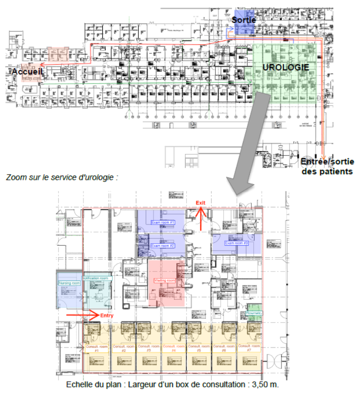
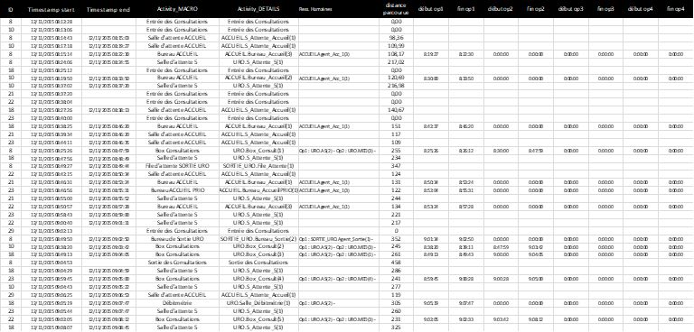

# Etude de cas sur l’analyse et la mesure de performance des Flux de Patients

## Introduction

Ce travail porte sur l'analyse des flux de patients sur un plateau mutualisé de consultations externes d'un hôpital.
L'objectif est de réaliser un diagnostic objectif de la performance organisationnelle du service d'urologie en s'appuyant sur les méthodes et outils d'analyse de flux vus précédemment ainsi que sur le langage R à travers l’environnement de RStudio.
La figure ci-dessous illustre les principaux flux ainsi que le Plan du plateau de consultations (voir fichiers PlanConsultations.pdf et ZoomURO.pdf consultables à partir <http://bit.ly/PlansCHUTlse>)

<!---->

 Afin de collecter des données sur les parcours suivis, les patients qui se sont présentés le 12/11/2015 ont été équipés d’une étiquette électronique (type RFID) qui a permis de tracer leurs parcours dans le plateau de consultation.
Les données collectées ont été fusionnées avec les données des outils de gestion des dossiers administratifs et médicaux utilisés par les personnels.
L'ensemble est disponible sous la forme d’un fichier log, illustré par le tableau suivant (voir annexe LogPatientUROseul_12112015.xlsx consultable à partir <http://bit.ly/logPatients>).

<!---->


Les différentes de ce tableau de données sont :

- *ID* (Col A) : Identifiant du patient

- *Timestamp start* (Col B) : horodatage entrée de zone ou salle

- *Timestamp end* (Col C) : horodatage sortie de zone ou salle

- *Activity_MACRO* (Col D) : Type d'activité

- *Activity_DETAILS* (Col E) : Activité suivie et indice salle (i)

- *Ress.Humaines* (Col F) : Ressources humaines administratives ou soignantes intervenant dans l'activité

- *distance parcourues* (Col G) : Distance parcourue cumulée

- *début/fin opX* (Col H à O) : horodatage début/fin de chaque opération de prise en charge par une ressource administrative ou soignante (maxi 4 opérations par activité).

## **Devoir 4 - Travail demandé** : Modélisation finale

Ce travail, qui peut-être effectué en binôme, est à rendre pour le **14/05/2026** au format Rmd ou R (+pdf si besoin) avec pour titre "NOM_Prenom_FI54-2-IOS-4-Devoir-4.\*" et fera l'objet d'une soutenance à cette même date.

Toujours dans la continuité des précédant devoirs, l'objectif de ce dernier devoir est de proposer une modélisation simulable finale de notre service d'urologie en 3 étapes :

1)  Modélisation des parcours patient par *Process Mining*

2)  Simulation du service d'accueil sous Anylogic

3)  Simulation du service d'urologie

```{r include=FALSE}
library(tidyverse)
library(data.table)
library(readxl)

load("local_data/trace_example_1.RData")
load("local_data/trace_example_final.RData")
devoir3_data_accueil = read_csv2("local_data/devoir3_data_accueil.csv")
```

### Question 1) Modélisation des parcours patient par *Process Mining* (/2.5)

Pour cette premier question, il vous est demandé de modéliser les parcours patient selon un modèle de chaîne de Markov.
On cherche à modéliser uniquement les étapes impliquant un agent de soins, c'est-à-dire qui utilise des ressources du service (contrairement aux étapes de déplacement et d'attente).

Par exemple pour le patient d'ID 10, on a 9 étapes :

```{r}
trace_example_final %>%
  filter(!is.na(CURRENT_OPERATION_NUMBER)) %>%
  filter(ID == 10)
```

Pour éviter toute difficulté liée à la complexité des opérations, on va regrouper les différents temps selon l'activité macro et le type d'acteur.
Par exemple, pour le patient d'ID 10, on a les temps "strictes" suivant :

```{r}
trace_example_final_b <- trace_example_final %>%
  filter(!is.na(CURRENT_OPERATION_NUMBER)) %>%
  filter(ID == 10) %>%
  mutate(ACTIVITY_MACRO = ifelse(str_detect(CURRENT_LOCATION,"Uro_Box"),
                                 "Consultation",NA),
         ACTIVITY_MACRO = ifelse(str_detect(CURRENT_LOCATION,"Uro_Examen"),
                                 "Examen",ACTIVITY_MACRO),
         ACTIVITY_MACRO = ifelse(str_detect(CURRENT_LOCATION,"Accueil"),
                                 "Accueil",ACTIVITY_MACRO),
         ACTIVITY_MACRO = ifelse(str_detect(CURRENT_LOCATION,"Sortie"),
                                 "Sortie",ACTIVITY_MACRO), # à continuer dans le cas général et à faire aussi par type d'agent de soins
         )
  
trace_example_final_b %>%
  group_by(ACTIVITY_MACRO,WITH_1) %>% # Attention, il faudra considérer le type d'acteur de manière agrégée
  summarize(time_in_minutes = sum(as.double(DATETIME_END) - as.double(DATETIME_BEGIN)) / 60) # Attention, il faudra calculer l'Effective Process Time
```

Attention ces temps ne sont pas tout à fait correcte pour notre type de modélisation, il faut prendre en compte des *Effective Time Process* en prenant en compte aussi les temps morts des acteurs (cf Devoir 3)

Pour vous aidez à parvenir à cette modélisation, une méthodologie vous est proposé :

- Commencez par une modélisation macro des activités générales simplement en regardant la probabilité d'occurence de celles-ci (en fonction aussi de si le patient est prioritaire ou non)

  - Dans le cas de notre patient ID 10, on a en 4 : Accueil, Consultation (Même si c'est coupé en 2), Examen, Sortie

  - Gardez l'ordre le plus fréquemment des activités observées (Accueil, Consultation, Examen ..., Sortie)

- Dans chacune des activités macro, modélisez la probabilité de faire appel à chaque type d'acteur et dans le cas où un doit intervenir modéliser *l'Effective Time Process* nécessaire avec une loi gamma (en fonction aussi de si le patient est prioritaire ou non)

  - Dans le cas de notre patient ID 10, on fait appel à 6 combinaisons activité / agents différents

- Comparer ce modèle simplifié construit avec la réalité observée et aussi avec un modèle plus détaillé qui n'agrégerait pas les différentes étapes et temps d'acteurs

```{r}
library(tidyverse)
library(lubridate)
library(MASS)
library(gridExtra)
select <- dplyr::select

load("local_data/trace_example_final.RData")
df <- trace_example_final

patients <- df %>% filter(TYPE == "PATIENT")

prio_ids <- unique(patients$ID[patients$CURRENT_LOCATION == "Accueil_Prio_1"])
patients <- patients %>%
  mutate(PRIO = ifelse(ID %in% prio_ids, "Prioritaire", "Standard"))

patients <- patients %>%
  mutate(ACTIVITY_MACRO = case_when(
    str_detect(CURRENT_LOCATION, "Uro_Box")            ~ "Consultation",
    str_detect(CURRENT_LOCATION, "Uro_Bureau_Annonce") ~ "Consultation",
    str_detect(CURRENT_LOCATION, "Uro_Bureau_IDE")     ~ "Consultation",
    str_detect(CURRENT_LOCATION, "Uro_Examen")         ~ "Examen",
    str_detect(CURRENT_LOCATION, "Uro_Debimetrie")     ~ "Examen",
    str_detect(CURRENT_LOCATION, "Accueil")            ~ "Accueil",
    str_detect(CURRENT_LOCATION, "Sortie")             ~ "Sortie",
    TRUE ~ NA_character_
  ))

patients <- patients %>%
  mutate(ACTOR_TYPE = case_when(
    str_detect(WITH_1, "ACCUEIL")         ~ "Agent_Accueil",
    str_detect(WITH_1, "SORTIE")          ~ "Agent_Sortie",
    str_detect(WITH_1, "URO.IDE_Annonce") ~ "IDE_Annonce",
    str_detect(WITH_1, "URO.IDE")         ~ "IDE",
    str_detect(WITH_1, "URO.AS")          ~ "AS",
    str_detect(WITH_1, "URO.MED")         ~ "MED",
    TRUE ~ NA_character_
  ))

ops <- patients %>%
  filter(!is.na(CURRENT_OPERATION_NUMBER)) %>%
  mutate(
    DATETIME_BEGIN = as.POSIXct(DATETIME_BEGIN),
    DATETIME_END   = as.POSIXct(DATETIME_END)
  ) %>%
  arrange(WITH_1, DATETIME_BEGIN) %>%
  group_by(WITH_1) %>%
  mutate(
    DATETIME_END_prev = lag(DATETIME_END),
    tdq = if_else(is.na(DATETIME_END_prev),
                  DATETIME_BEGIN,
                  pmax(DATETIME_BEGIN, DATETIME_END_prev)),
    EPT_secs = as.numeric(difftime(DATETIME_END, tdq, units = "secs")),
    EPT_min  = EPT_secs / 60
  ) %>%
  ungroup()

ops %>%
  filter(ID == 10) %>%
  dplyr::select(ACTIVITY_MACRO, WITH_1, ACTOR_TYPE, DATETIME_BEGIN, DATETIME_END, EPT_min)


```

```{r}
etats <- c("Accueil", "Consultation", "Examen", "Sortie")

sequences <- patients %>%
  filter(!is.na(ACTIVITY_MACRO), ACTIVITY_MACRO %in% etats) %>%
  arrange(ID, DATETIME_BEGIN) %>%
  group_by(ID, PRIO) %>%
  mutate(MACRO_prev = lag(ACTIVITY_MACRO)) %>%
  filter(is.na(MACRO_prev) | ACTIVITY_MACRO != MACRO_prev) %>%
  summarise(sequence = list(ACTIVITY_MACRO), .groups = "drop")

seq_freq <- sequences %>%
  mutate(seq_str = sapply(sequence, paste, collapse = " -> ")) %>%
  count(seq_str, sort = TRUE) %>%
  mutate(pct = round(n / sum(n) * 100, 1))

print(seq_freq)

trans_count <- matrix(0, 4, 4, dimnames = list(from = etats, to = etats))

for (seq in sequences$sequence) {
  if (length(seq) >= 2) {
    for (i in seq_len(length(seq) - 1)) {
      f <- seq[i]; t <- seq[i + 1]
      if (f %in% etats && t %in% etats)
        trans_count[f, t] <- trans_count[f, t] + 1
    }
  }
}

trans_prob <- trans_count / rowSums(trans_count)
trans_prob[is.nan(trans_prob)] <- 0

cat("=== Matrice de transition ===\n")
print(round(trans_prob, 3))
```

La séquence la plus fréquente est Accueil → Consultation → Sortie (44.1% des patients), ce qui correspond aux patients ne nécessitant pas d'examen complémentaire.
La deuxième séquence la plus fréquente Accueil → Consultation → Examen → Consultation → Sortie (22.1%) illustre le circuit typique d'un patient nécessitant un examen puis un retour en consultation pour interprétation des résultats.
La matrice de transition révèle plusieurs points importants.
Tous les patients passent par l'Accueil avant d'aller en Consultation (86.8%) ou directement en Examen (13.2%), ce qui correspond aux patients orientés directement vers un examen sans consultation préalable.
Depuis la Consultation, 58.3% des patients terminent leur parcours en Sortie tandis que 41.7% sont envoyés en Examen.
Depuis l'Examen, 75.5% des patients retournent en Consultation — probablement pour que le médecin interprète les résultats — et seulement 24.5% vont directement en Sortie.

```{r}

as.data.frame(trans_prob) %>%
  rownames_to_column("De") %>%
  pivot_longer(-De, names_to = "Vers", values_to = "Prob") %>%
  filter(Prob > 0) %>%
  ggplot(aes(x = Vers, y = De, fill = Prob)) +
  geom_tile(color = "white", linewidth = 1) +
  geom_text(aes(label = paste0(round(Prob * 100, 1), "%")),
            color = "white", fontface = "bold", size = 5) +
  scale_fill_gradient(low = "#42A5F5", high = "#0D47A1") +
  labs(title = "Matrice de transition — Chaîne de Markov MACRO",
       x = "Activité suivante", y = "Activité courante") +
  theme_minimal(base_size = 13) +
  theme(panel.grid = element_blank())
```

La heatmap confirme visuellement la structure séquentielle du parcours patient : il n'existe pas de retour vers l'Accueil depuis une autre activité, et la Sortie est bien un état absorbant.
Les probabilités de transition les plus fortes sont Accueil → Consultation (86.8%) et Examen → Consultation (75.5%), ce qui souligne le rôle central de la Consultation dans le parcours urologique.

```{r}
nb_passages <- sequences %>%
  unnest(sequence) %>%
  rename(ACTIVITY_MACRO = sequence) %>%
  count(PRIO, ACTIVITY_MACRO, name = "nb_passages")

nb_ops <- ops %>%
  filter(!is.na(ACTOR_TYPE)) %>%
  group_by(PRIO, ACTIVITY_MACRO, ACTOR_TYPE, ID) %>%
  summarise(intervient = 1, .groups = "drop") %>%
  group_by(PRIO, ACTIVITY_MACRO, ACTOR_TYPE) %>%
  summarise(nb_ops = n(), .groups = "drop")

proba_res <- nb_ops %>%
  left_join(nb_passages, by = c("PRIO", "ACTIVITY_MACRO")) %>%
  mutate(prob = round(nb_ops / nb_passages, 3))

print(proba_res)

ggplot(proba_res, aes(x = ACTOR_TYPE, y = prob, fill = PRIO)) +
  geom_bar(stat = "identity", position = "dodge", alpha = 0.85) +
  geom_text(aes(label = round(prob, 2)),
            position = position_dodge(0.9), vjust = -0.4, size = 3) +
  facet_wrap(~ ACTIVITY_MACRO, scales = "free_x") +
  scale_fill_manual(values = c("Prioritaire" = "#E53935", "Standard" = "#1565C0")) +
  labs(title = "Probabilité de sollicitation des ressources",
       x = "Type de ressource", y = "Probabilité", fill = "Type patient") +
  theme_minimal() +
  theme(axis.text.x = element_text(angle = 30, hjust = 1))
```

L'analyse des probabilités de sollicitation révèle des différences notables entre activités et types de patients.
En Accueil, tous les patients (100%) voient un Agent_Accueil, ce qui est attendu.
En Consultation, le MED est sollicité dans environ 57-61% des passages, l'AS dans 56-57% des cas, tandis que l'IDE (7-14%) et l'IDE_Annonce (7-18%) interviennent plus rarement, uniquement pour certains actes spécifiques.
Les probabilités sont globalement similaires entre patients prioritaires et standards en Consultation, ce qui suggère que la priorité concerne davantage l'ordre de passage que la nature des actes réalisés.
En Examen, l'IDE est la ressource la plus sollicitée (50-73% des passages), suivie de l'AS (50-58%) et du MED (38-61%).
La variabilité plus importante entre prioritaires et standards en Examen peut s'expliquer par le faible nombre de patients prioritaires ayant eu un examen (n=10), ce qui rend les estimations moins stables.

```{r}

ops_valid <- ops %>%
  filter(!is.na(ACTOR_TYPE), !is.na(EPT_min), EPT_min > 0)

combos <- ops_valid %>%
  group_by(ACTIVITY_MACRO, ACTOR_TYPE, PRIO) %>%
  summarise(n = n(), .groups = "drop") %>%
  filter(n >= 5)

resultats_gamma <- data.frame()

for (i in seq_len(nrow(combos))) {
  m <- combos$ACTIVITY_MACRO[i]
  a <- combos$ACTOR_TYPE[i]
  p <- combos$PRIO[i]

  x <- ops_valid$EPT_min[
    ops_valid$ACTIVITY_MACRO == m &
    ops_valid$ACTOR_TYPE == a &
    ops_valid$PRIO == p
  ]

  fit <- tryCatch(fitdistr(x, "gamma"), error = function(e) NULL)

  if (!is.null(fit)) {
    sh <- fit$estimate["shape"]
    ra <- fit$estimate["rate"]
    resultats_gamma <- bind_rows(resultats_gamma, data.frame(
      PRIO = p, ACTIVITY_MACRO = m, ACTOR_TYPE = a,
      n = length(x),
      shape = round(sh, 3),
      rate  = round(ra, 3),
      mean_EPT_min = round(sh / ra, 2),
      cv = round(1 / sqrt(sh), 3)
    ))
  }
}

print(resultats_gamma)

```

Les paramètres des lois gamma montrent des disparités importantes entre les types de ressources.
Les temps de service les plus longs sont observés pour l'IDE_Annonce en Consultation (mean_EPT = 38.54 min), qui correspond à l'annonce de résultats médicaux, une étape naturellement longue car elle implique une communication approfondie avec le patient.
Le MED en Consultation présente également des temps longs (13-14 min) avec un coefficient de variation élevé (CV ≈ 0.72-0.75), traduisant une forte variabilité liée à la complexité variable des cas.
À l'inverse, les temps les plus courts sont observés pour l'AS en Consultation (mean_EPT ≈ 0.62-0.65 min) et l'AS en Examen (mean_EPT ≈ 1.15-1.24 min), ce qui correspond à des actes techniques brefs.
Les CV faibles pour l'Agent_Accueil (≈ 0.20) et le MED en Examen prioritaire (≈ 0.34) indiquent des processus bien standardisés, tandis que les CV élevés pour l'Agent_Sortie (≈ 0.83-0.87) suggèrent une variabilité importante dans les formalités administratives de sortie.

```{r}
plots <- list()

for (i in seq_len(nrow(resultats_gamma))) {
  row <- resultats_gamma[i, ]
  x <- ops_valid$EPT_min[
    ops_valid$ACTIVITY_MACRO == row$ACTIVITY_MACRO &
    ops_valid$ACTOR_TYPE == row$ACTOR_TYPE &
    ops_valid$PRIO == row$PRIO
  ]
  x_seq <- seq(0, max(x) * 1.2, length.out = 300)
  gd    <- dgamma(x_seq, shape = row$shape, rate = row$rate)

  p <- ggplot(data.frame(x = x), aes(x = x)) +
    geom_histogram(aes(y = after_stat(density)), bins = 12,
                   fill = ifelse(row$PRIO == "Prioritaire", "#E53935", "#1565C0"),
                   alpha = 0.6, color = "white") +
    geom_line(data = data.frame(x = x_seq, y = gd),
              aes(x = x, y = y), color = "black", linewidth = 1) +
    labs(title = paste0(row$ACTIVITY_MACRO, " / ", row$ACTOR_TYPE, " (", row$PRIO, ")"),
         subtitle = paste0("Gamma(shape=", row$shape, ", rate=", row$rate, ") | n=", row$n),
         x = "EPT (min)", y = "Densité") +
    theme_minimal(base_size = 9)

  plots[[length(plots) + 1]] <- p
}

do.call(grid.arrange, c(plots, ncol = 3))
```

Les histogrammes confirment visuellement la pertinence de l'ajustement par loi gamma.
Pour les ressources avec des CV faibles (Agent_Accueil, MED en Examen Prioritaire), les distributions sont bien concentrées autour de la moyenne et la courbe gamma s'ajuste précisément.
Pour les ressources avec des CV élevés (MED en Consultation, IDE_Annonce, Agent_Sortie), les distributions sont plus étalées et asymétriques à droite, ce qui est bien capturé par la loi gamma avec un paramètre de forme faible (shape \< 2).

```{r}

set.seed(42)
N_sim <- 1000

sim_parcours <- function() {
  etat <- "Accueil"
  parcours <- etat
  while (etat != "Sortie" && length(parcours) < 8) {
    probs <- trans_prob[etat, ]
    if (sum(probs) == 0) break
    etat <- sample(etats, 1, prob = probs)
    parcours <- c(parcours, etat)
  }
  paste(parcours, collapse = " -> ")
}

sim_seqs <- replicate(N_sim, sim_parcours())
sim_table <- as.data.frame(table(sim_seqs)) %>%
  rename(seq_str = sim_seqs, n_sim = Freq) %>%
  mutate(pct_sim = round(n_sim / N_sim * 100, 1))

obs_table <- sequences %>%
  mutate(seq_str = sapply(sequence, paste, collapse = " -> ")) %>%
  count(seq_str) %>%
  mutate(pct_obs = round(n / sum(n) * 100, 1))

# Garder uniquement les séquences observées dans les données réelles
comparison <- obs_table %>%
  left_join(sim_table, by = "seq_str") %>%
  replace_na(list(n_sim = 0, pct_sim = 0)) %>%
  arrange(desc(pct_obs)) %>%
  # Tronquer les labels longs
  mutate(seq_label = ifelse(nchar(seq_str) > 50,
                            paste0(substr(seq_str, 1, 47), "..."),
                            seq_str))

print(comparison %>% dplyr::select(seq_str, pct_obs, pct_sim))

comparison %>%
  pivot_longer(cols = c(pct_obs, pct_sim), names_to = "Source", values_to = "Pct") %>%
  mutate(Source = ifelse(Source == "pct_obs", "Observé", "Simulé (Markov)")) %>%
  ggplot(aes(x = reorder(seq_label, Pct), y = Pct, fill = Source)) +
  geom_bar(stat = "identity", position = "dodge", alpha = 0.85) +
  geom_text(aes(label = paste0(Pct, "%")),
            position = position_dodge(0.9), hjust = -0.1, size = 3) +
  coord_flip() +
  scale_fill_manual(values = c("Observé" = "#1565C0", "Simulé (Markov)" = "#E53935")) +
  labs(title = "Validation : observé vs modèle de Markov (N=1000)",
       x = "Séquence", y = "Fréquence (%)") +
  theme_minimal() +
  expand_limits(y = max(comparison$pct_obs, comparison$pct_sim, na.rm = TRUE) * 1.4)
```

La validation par simulation Monte Carlo montre que le modèle de chaîne de Markov reproduit raisonnablement bien la réalité observée.
La séquence la plus fréquente (Accueil → Consultation → Sortie) est légèrement surestimée par le modèle (50.9% simulé vs 44.1% observé), tandis que la séquence avec un aller-retour Examen → Consultation est légèrement sous-estimée (16.5% simulé vs 22.1% observé).
Ces écarts s'expliquent par le fait que le modèle de Markov suppose que chaque transition est indépendante de l'historique du patient, ce qui ne capture pas parfaitement les dépendances entre étapes successives.
Néanmoins, l'ordre de grandeur des fréquences est bien respecté, ce qui valide l'utilisation de ce modèle pour paramétrer la simulation AnyLogic de la question 3.

```{r}
# Modèle détaillé : on garde CURRENT_LOCATION sans agréger en ACTIVITY_MACRO
ops_detail <- ops %>%
  filter(!is.na(ACTOR_TYPE), !is.na(EPT_min), EPT_min > 0)

combos_detail <- ops_detail %>%
  group_by(CURRENT_LOCATION, ACTOR_TYPE, PRIO) %>%
  summarise(n = n(), .groups = "drop") %>%
  filter(n >= 5)

resultats_detail <- data.frame()

for (i in seq_len(nrow(combos_detail))) {
  loc <- combos_detail$CURRENT_LOCATION[i]
  a   <- combos_detail$ACTOR_TYPE[i]
  p   <- combos_detail$PRIO[i]

  x <- ops_detail$EPT_min[
    ops_detail$CURRENT_LOCATION == loc &
    ops_detail$ACTOR_TYPE == a &
    ops_detail$PRIO == p
  ]

  fit <- tryCatch(fitdistr(x, "gamma"), error = function(e) NULL)

  if (!is.null(fit)) {
    sh <- fit$estimate["shape"]
    ra <- fit$estimate["rate"]
    resultats_detail <- bind_rows(resultats_detail, data.frame(
      PRIO = p, CURRENT_LOCATION = loc, ACTOR_TYPE = a,
      n = length(x),
      shape = round(sh, 3),
      rate  = round(ra, 3),
      mean_EPT_min = round(sh / ra, 2),
      cv = round(1 / sqrt(sh), 3)
    ))
  }
}

print(resultats_detail)
# Comparaison modèle simplifié vs modèle détaillé
# On ajoute la colonne ACTIVITY_MACRO dans le détaillé pour pouvoir comparer
resultats_detail <- resultats_detail %>%
  mutate(ACTIVITY_MACRO = case_when(
    str_detect(CURRENT_LOCATION, "Uro_Box")            ~ "Consultation",
    str_detect(CURRENT_LOCATION, "Uro_Bureau_Annonce") ~ "Consultation",
    str_detect(CURRENT_LOCATION, "Uro_Bureau_IDE")     ~ "Consultation",
    str_detect(CURRENT_LOCATION, "Uro_Examen")         ~ "Examen",
    str_detect(CURRENT_LOCATION, "Uro_Debimetrie")     ~ "Examen",
    str_detect(CURRENT_LOCATION, "Accueil")            ~ "Accueil",
    str_detect(CURRENT_LOCATION, "Sortie")             ~ "Sortie",
    TRUE ~ NA_character_
  ))

# Comparaison des moyennes EPT : simplifié vs détaillé
comp_modeles <- resultats_gamma %>%
  dplyr::select(PRIO, ACTIVITY_MACRO, ACTOR_TYPE, 
                mean_simple = mean_EPT_min, cv_simple = cv) %>%
  left_join(
    resultats_detail %>%
      group_by(PRIO, ACTIVITY_MACRO, ACTOR_TYPE) %>%
      summarise(
        mean_detail = round(weighted.mean(mean_EPT_min, n), 2),
        cv_detail   = round(mean(cv), 3),
        .groups = "drop"
      ),
    by = c("PRIO", "ACTIVITY_MACRO", "ACTOR_TYPE")
  ) %>%
  mutate(diff_mean_pct = round((mean_detail - mean_simple) / mean_simple * 100, 1))

cat("=== Comparaison modèle simplifié vs modèle détaillé ===\n")
print(comp_modeles)

# Visualisation
comp_modeles %>%
  pivot_longer(cols = c(mean_simple, mean_detail),
               names_to = "Modele", values_to = "mean_EPT") %>%
  mutate(
    Modele = ifelse(Modele == "mean_simple", "Simplifié", "Détaillé"),
    label  = paste0(ACTOR_TYPE, "\n(", PRIO, ")")
  ) %>%
  ggplot(aes(x = label, y = mean_EPT, fill = Modele)) +
  geom_bar(stat = "identity", position = "dodge", alpha = 0.85) +
  geom_text(aes(label = round(mean_EPT, 1)),
            position = position_dodge(0.9), vjust = -0.4, size = 2.8) +
  facet_wrap(~ ACTIVITY_MACRO, scales = "free") +
  scale_fill_manual(values = c("Simplifié" = "#1565C0", "Détaillé" = "#E53935")) +
  labs(title = "Comparaison EPT moyen : modèle simplifié vs modèle détaillé",
       x = "Ressource (type patient)", y = "EPT moyen (min)", fill = "Modèle") +
  theme_minimal(base_size = 9) +
  theme(axis.text.x = element_text(angle = 30, hjust = 1))

```

La comparaison entre le modèle simplifié (agrégé par ACTIVITY_MACRO) et le modèle détaillé (par location individuelle) montre que les EPT moyens sont très proches dans la majorité des cas, avec des écarts inférieurs à 5% pour la plupart des combinaisons.
Les différences les plus importantes sont observées pour le MED en Consultation Prioritaire (-20.5%) et l'AS en Examen Standard (+35.5%), ce qui indique que l'agrégation introduit un biais non négligeable pour ces ressources spécifiques.
Ces résultats valident globalement l'approche simplifiée : le regroupement par activité macro ne déforme pas significativement les distributions de temps de service dans la plupart des cas.
Le modèle simplifié offre donc un bon compromis entre fidélité à la réalité et complexité de modélisation, ce qui justifie son utilisation pour paramétrer la simulation du service d'urologie en question 3.

### Question 2) Simulation du service d'accueil sous Anylogic (/2.5)

A l'aide d'Anylogic, construisez le modèle de simulation correspondant à ce que vous avez fait au devoir 3 avec un modèle à 1 serveur pour le bureau prioritaire et un modèle à 3 serveurs pour les autres.
Vous testerez différents combinaisons de scénarios :

- Arrivées réelles puis arrivées de poisson puis arrivées de poisson non homogènes

- Temps services exponentiels puis gamma

Pour les scénarios avec arrivées de poisson (homogènes et non homogènes), regarder l'évolution du niveau d'occupation et d'attente en fonction du taux lambda d'arrivé (différent de celui mesuré) et vérifiez bien que la saturation du service arrivé quand le taux d'arrivé atteint le taux de service maximal (quand $\rho \geq 1$).

Finalement, à partir des arrivées réelles, testez le comportement du modèle pour différents nombre de serveurs avec un planning "dynamique" sur les tranches [8h;14h] et [14h;20h] avec 1 à 4 agents d'accueil disponibles par tranche (les patients prioritaires / non prioritaires peuvent être redirigés vers un autre bureau que celui où il doit aller initialement).

### Question 3) Simulation du service d'urologie (/5)

Avec la même méthodologie, et en considérant les circuits patients de la question 1, modélisez l'ensemble du service d'urologie sous Anylogic afin de répondre aux questions suivantes :

```         
- En considérant un processus de Poisson non homogène avec les taux d'arrivées observées dans les données et le modèle de circuit patient de la question 1, quel est la configuration du planning sur les 2 tranches [8h;14h] et [14h;20h] qui **minimise le nombre d'agents moyen** sur la journée tout en évitant la saturation (tous les patients doivent avoir fini leur prise en charge avant 20h) ? 

- En prenant en considération le niveau d'occupation avec cette configuration et le/les goulet(s) d'étranglement, proposez un planning un peu plus robuste / raisonnable (avec 1 ou 2 plannifications d'acteurs en plus sur les tranches de service) qui diminuerait drastiquement le niveau d'occupation / d'attente moyen.
```

### Discussion supplémentaire (points complémentaires sur chaque question)

Profitez en pour comparer votre modèle à la réalité.

### Soutenance (/10)

Préparez une **présentation orale de votre démarche**, de vos résulats et analyses de 15 min pour le **14/05**.
