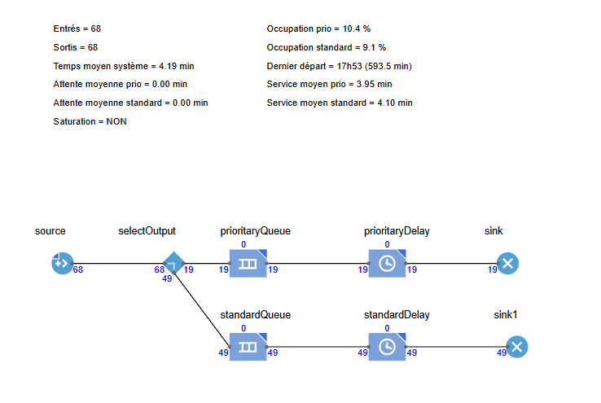
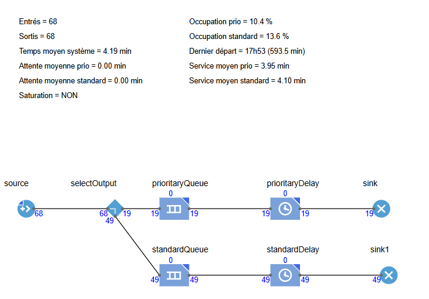
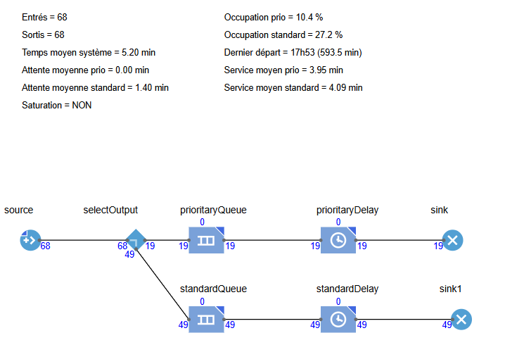
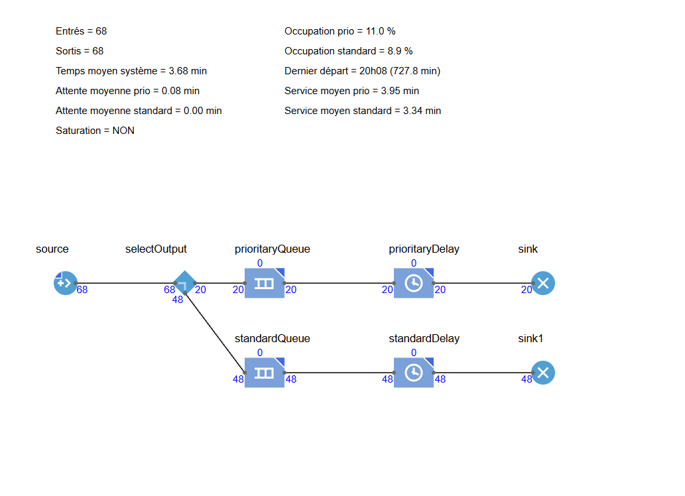
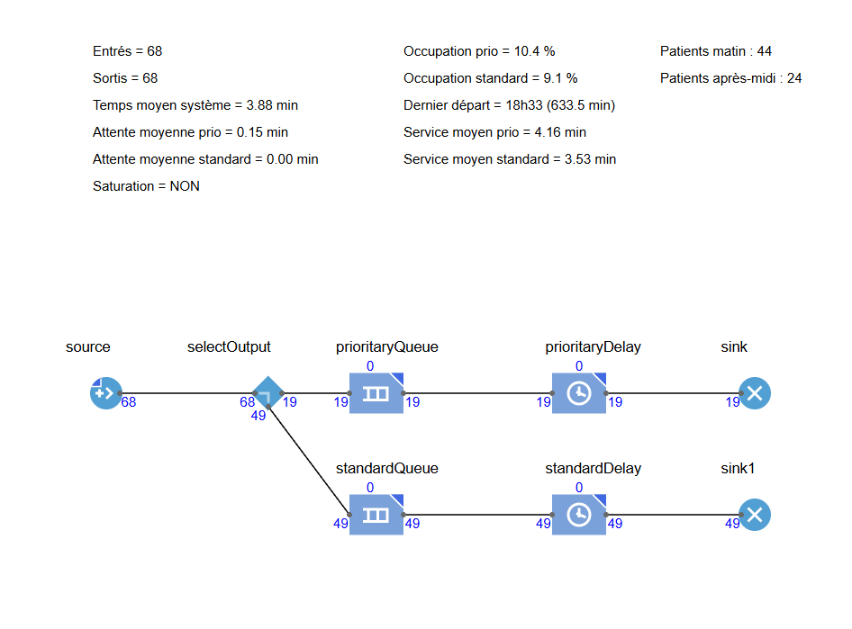
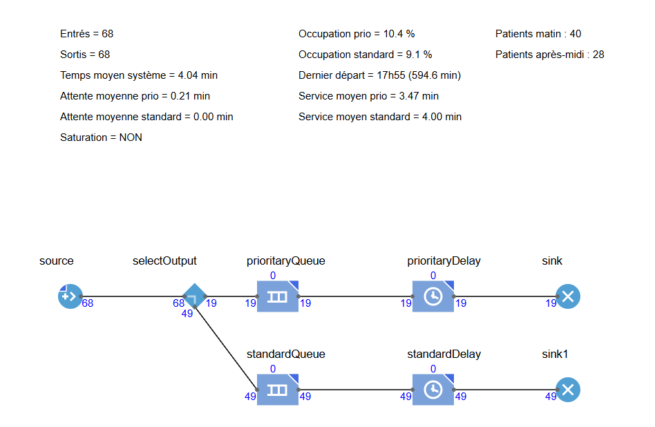

------------------------------------------------------------------------

---
title: "FIE5-2-IOS-4-Devoir-4"
author: "Julia Ricchi & Chiara Soulié"
date: "2026-05-14"
output: html_notebook
editor_options: 
  markdown: 
    wrap: sentence
---

# Étude de cas : Analyse et modélisation des flux de patients en urologie

## Introduction

Ce rapport s'inscrit dans le cadre de l'analyse du fonctionnement d'un plateau mutualisé de consultations externes au sein d'un service hospitalier d'urologie. L'objectif principal est de construire une modélisation réaliste et simulable du service, en nous appuyant sur des données de traçabilité patient collectées via des étiquettes électroniques de type RFID le 12/11/2015. Ces données, fusionnées avec les informations des systèmes d'information administratifs et médicaux, constituent le fichier de log sur lequel repose l'ensemble de notre analyse.

La figure ci-dessous présente le plan du plateau de consultations (voir fichiers PlanConsultations.pdf et ZoomURO.pdf disponibles sur <http://bit.ly/PlansCHUTlse>).


Les colonnes du fichier de données sont les suivantes :

- *ID* (Col A) : Identifiant anonymisé du patient

- *Timestamp start* (Col B) : Horodatage d'entrée dans une zone ou salle

- *Timestamp end* (Col C) : Horodatage de sortie de la zone ou salle

- *Activity_MACRO* (Col D) : Catégorie d'activité (ex. Accueil, Consultation…)

- *Activity_DETAILS* (Col E) : Détail de l'activité et indice de salle (i)

- *Ress.Humaines* (Col F) : Ressources humaines mobilisées (personnel administratif ou soignant)

- *distance parcourues* (Col G) : Distance cumulée parcourue par le patient

- *début/fin opX* (Col H à O) : Horodatages de début et de fin pour chaque opération de prise en charge (jusqu'à 4 opérations par activité)

Le tableau de données est consultable ici : <http://bit.ly/logPatients>


## **Devoir 4 — Travail demandé** : Modélisation finale

Ce devoir, réalisé en binôme, est à rendre pour le **14/05/2026** au format Rmd (+ PDF si nécessaire), avec pour titre `NOM_Prenom_FIE5-2-IOS-4-Devoir-4.*`. Il fera l'objet d'une soutenance à cette même date.

L'objectif de ce dernier devoir est de produire une modélisation simulable complète du service d'urologie, articulée en trois étapes :

1)  Modélisation des parcours patient par *Process Mining*

2)  Simulation du service d'accueil sous AnyLogic

3)  Simulation globale du service d'urologie

```{r include=FALSE}
library(tidyverse)
library(data.table)
library(readxl)
library(purrr) 

load("local_data/trace_example_1.RData")
load("local_data/trace_example_final.RData")
devoir3_data_accueil = read_csv2("local_data/devoir3_data_accueil.csv")
```

### Question 1) Modélisation des parcours patient par *Process Mining* (/2.5)

L'objectif de cette question est de modéliser les parcours des patients sous la forme d'une **chaîne de Markov**. Nous nous concentrons uniquement sur les étapes impliquant une ressource soignante ou administrative, en excluant les déplacements et les temps d'attente passifs.

Pour illustrer la démarche, prenons l'exemple du patient d'identifiant 10, dont le parcours comporte 9 opérations :

```{r}
trace_example_final %>%
  filter(!is.na(CURRENT_OPERATION_NUMBER)) %>%
  filter(ID == 10)
```

Afin de simplifier l'analyse, nous regroupons les opérations par **activité macro** et par **type d'acteur**. Pour le patient 10, cela donne les temps "stricts" suivants (sans encore tenir compte des temps morts des acteurs) :

```{r}
trace_example_final_b <- trace_example_final %>%
  filter(!is.na(CURRENT_OPERATION_NUMBER)) %>%
  filter(ID == 10) %>%
  mutate(ACTIVITY_MACRO = ifelse(str_detect(CURRENT_LOCATION,"Uro_Box"),
                                 "Consultation",NA),
         ACTIVITY_MACRO = ifelse(str_detect(CURRENT_LOCATION,"Uro_Examen"),
                                 "Examen",ACTIVITY_MACRO),
         ACTIVITY_MACRO = ifelse(str_detect(CURRENT_LOCATION,"Accueil"),
                                 "Accueil",ACTIVITY_MACRO),
         ACTIVITY_MACRO = ifelse(str_detect(CURRENT_LOCATION,"Sortie"),
                                 "Sortie",ACTIVITY_MACRO),
         )
  
trace_example_final_b %>%
  group_by(ACTIVITY_MACRO,WITH_1) %>%
  summarize(time_in_minutes = sum(as.double(DATETIME_END) - as.double(DATETIME_BEGIN)) / 60)
```

> **Remarque importante** : ces temps bruts ne suffisent pas pour paramétrer correctement notre modèle. Il est nécessaire de calculer l'***Effective Process Time*** (EPT) de chaque acteur, en intégrant les temps morts survenus entre deux opérations successives d'un même acteur (cf. Devoir 3).

La méthodologie adoptée pour construire le modèle de Markov est la suivante :

**Étape 1 — Modélisation macro des séquences d'activités**

Nous calculons d'abord la fréquence d'occurrence de chaque séquence d'activités macro, en distinguant les patients prioritaires des patients standard. Pour le patient 10, la séquence observée est : Accueil → Consultation → Examen → Sortie (4 étapes).

**Étape 2 — Modélisation des ressources au sein de chaque activité**

Pour chaque activité macro, nous estimons la probabilité qu'un acteur donné intervienne, puis nous modélisons la durée de son intervention par une **loi gamma**, paramétrée séparément pour les patients prioritaires et standard. Le patient 10 mobilise 6 combinaisons activité / acteur distinctes.

**Étape 3 — Validation par comparaison avec un modèle plus détaillé**

Nous comparons notre modèle simplifié (agrégé par activité macro) à un modèle plus granulaire (par salle individuelle), afin d'évaluer le biais introduit par l'agrégation.

------------------------------------------------------------------------

#### 1.a — Préparation des données et calcul de l'EPT

```{r}
library(tidyverse)
library(lubridate)
library(MASS)
library(gridExtra)
select <- dplyr::select

load("local_data/trace_example_final.RData")
df <- trace_example_final

patients <- df %>% filter(TYPE == "PATIENT")

prio_ids <- unique(patients$ID[patients$CURRENT_LOCATION == "Accueil_Prio_1"])
patients <- patients %>%
  mutate(PRIO = ifelse(ID %in% prio_ids, "Prioritaire", "Standard"))

patients <- patients %>%
  mutate(ACTIVITY_MACRO = case_when(
    str_detect(CURRENT_LOCATION, "Uro_Box")            ~ "Consultation",
    str_detect(CURRENT_LOCATION, "Uro_Bureau_Annonce") ~ "Consultation",
    str_detect(CURRENT_LOCATION, "Uro_Bureau_IDE")     ~ "Consultation",
    str_detect(CURRENT_LOCATION, "Uro_Examen")         ~ "Examen",
    str_detect(CURRENT_LOCATION, "Uro_Debimetrie")     ~ "Examen",
    str_detect(CURRENT_LOCATION, "Accueil")            ~ "Accueil",
    str_detect(CURRENT_LOCATION, "Sortie")             ~ "Sortie",
    TRUE ~ NA_character_
  ))

patients <- patients %>%
  mutate(ACTOR_TYPE = case_when(
    str_detect(WITH_1, "ACCUEIL")         ~ "Agent_Accueil",
    str_detect(WITH_1, "SORTIE")          ~ "Agent_Sortie",
    str_detect(WITH_1, "URO.IDE_Annonce") ~ "IDE_Annonce",
    str_detect(WITH_1, "URO.IDE")         ~ "IDE",
    str_detect(WITH_1, "URO.AS")          ~ "AS",
    str_detect(WITH_1, "URO.MED")         ~ "MED",
    TRUE ~ NA_character_
  ))

ops <- patients %>%
  filter(!is.na(CURRENT_OPERATION_NUMBER)) %>%
  mutate(
    DATETIME_BEGIN = as.POSIXct(DATETIME_BEGIN),
    DATETIME_END   = as.POSIXct(DATETIME_END)
  ) %>%
  arrange(WITH_1, DATETIME_BEGIN) %>%
  group_by(WITH_1) %>%
  mutate(
    DATETIME_END_prev = lag(DATETIME_END),
    tdq = if_else(is.na(DATETIME_END_prev),
                  DATETIME_BEGIN,
                  pmax(DATETIME_BEGIN, DATETIME_END_prev)),
    EPT_secs = as.numeric(difftime(DATETIME_END, tdq, units = "secs")),
    EPT_min  = EPT_secs / 60
  ) %>%
  ungroup()

ops %>%
  filter(ID == 10) %>%
  dplyr::select(ACTIVITY_MACRO, WITH_1, ACTOR_TYPE, DATETIME_BEGIN, DATETIME_END, EPT_min)
```

Le calcul de l'EPT consiste à déterminer, pour chaque opération d'un acteur, le temps effectivement consacré au patient en tenant compte de l'éventuelle disponibilité de l'acteur depuis la fin de l'opération précédente. Ainsi, si un acteur finit une prise en charge à 9h05 et commence la suivante à 9h10, l'EPT de la seconde opération ne démarre pas à 9h00 (heure d'entrée du patient) mais à 9h05, ce qui évite de sur-estimer les temps de service.

------------------------------------------------------------------------

#### 1.b — Construction de la chaîne de Markov macro

```{r}
etats <- c("Accueil", "Consultation", "Examen", "Sortie")

sequences <- patients %>%
  filter(!is.na(ACTIVITY_MACRO), ACTIVITY_MACRO %in% etats) %>%
  arrange(ID, DATETIME_BEGIN) %>%
  group_by(ID, PRIO) %>%
  mutate(MACRO_prev = lag(ACTIVITY_MACRO)) %>%
  filter(is.na(MACRO_prev) | ACTIVITY_MACRO != MACRO_prev) %>%
  summarise(sequence = list(ACTIVITY_MACRO), .groups = "drop")

seq_freq <- sequences %>%
  mutate(seq_str = sapply(sequence, paste, collapse = " -> ")) %>%
  count(seq_str, sort = TRUE) %>%
  mutate(pct = round(n / sum(n) * 100, 1))

print(seq_freq)

trans_count <- matrix(0, 4, 4, dimnames = list(from = etats, to = etats))

for (seq in sequences$sequence) {
  if (length(seq) >= 2) {
    for (i in seq_len(length(seq) - 1)) {
      f <- seq[i]; t <- seq[i + 1]
      if (f %in% etats && t %in% etats)
        trans_count[f, t] <- trans_count[f, t] + 1
    }
  }
}

trans_prob <- trans_count / rowSums(trans_count)
trans_prob[is.nan(trans_prob)] <- 0

cat("=== Matrice de transition — Chaîne de Markov ===\n")
print(round(trans_prob, 3))
```

La séquence dominante est **Accueil → Consultation → Sortie**, représentant 44,1 % des patients. Il s'agit du parcours "simple" pour les patients dont la consultation ne nécessite pas d'examen complémentaire. La deuxième séquence la plus fréquente (**Accueil → Consultation → Examen → Consultation → Sortie**, 22,1 %) correspond au circuit classique d'un patient orienté vers un examen, suivi d'un retour en consultation pour l'interprétation des résultats.

La matrice de transition met en évidence la structure fortement séquentielle du parcours :

- Depuis l'Accueil, la grande majorité des patients se dirigent vers la Consultation (86,8 %), les 13,2 % restants étant orientés directement vers l'Examen.
- Depuis la Consultation, environ 58 % des patients sortent du service, tandis que 42 % sont envoyés en Examen.
- Depuis l'Examen, 75,5 % des patients retournent en Consultation (pour l'interprétation des résultats) et 24,5 % quittent directement le service.

Il n'existe pas de transition de retour vers l'Accueil, ce qui confirme que cet état est un point d'entrée unique. La Sortie est un **état absorbant** : aucun patient ne repart vers une autre activité une fois sorti.

```{r}
as.data.frame(trans_prob) %>%
  rownames_to_column("De") %>%
  pivot_longer(-De, names_to = "Vers", values_to = "Prob") %>%
  filter(Prob > 0) %>%
  ggplot(aes(x = Vers, y = De, fill = Prob)) +
  geom_tile(color = "white", linewidth = 1) +
  geom_text(aes(label = paste0(round(Prob * 100, 1), "%")),
            color = "white", fontface = "bold", size = 5) +
  scale_fill_gradient(low = "#80CBC4", high = "#00695C") +
  labs(title = "Matrice de transition — Chaîne de Markov MACRO",
       x = "Activité suivante", y = "Activité courante",
       fill = "Probabilité") +
  theme_minimal(base_size = 13) +
  theme(panel.grid = element_blank())
```

La heatmap confirme la lecture de la matrice : les transitions les plus probables (teinte foncée) sont **Accueil → Consultation** et **Examen → Consultation**, ce qui souligne le rôle pivot de la Consultation dans l'organisation du service. L'absence de case colorée sur la ligne "Sortie" confirme bien son caractère absorbant.

------------------------------------------------------------------------

#### 1.c — Probabilités de sollicitation des ressources

```{r}
nb_passages <- sequences %>%
  unnest(sequence) %>%
  rename(ACTIVITY_MACRO = sequence) %>%
  count(PRIO, ACTIVITY_MACRO, name = "nb_passages")

nb_ops <- ops %>%
  filter(!is.na(ACTOR_TYPE)) %>%
  group_by(PRIO, ACTIVITY_MACRO, ACTOR_TYPE, ID) %>%
  summarise(intervient = 1, .groups = "drop") %>%
  group_by(PRIO, ACTIVITY_MACRO, ACTOR_TYPE) %>%
  summarise(nb_ops = n(), .groups = "drop")

proba_res <- nb_ops %>%
  left_join(nb_passages, by = c("PRIO", "ACTIVITY_MACRO")) %>%
  mutate(prob = round(nb_ops / nb_passages, 3))

print(proba_res)

ggplot(proba_res, aes(x = ACTOR_TYPE, y = prob, fill = PRIO)) +
  geom_bar(stat = "identity", position = "dodge", alpha = 0.85) +
  geom_text(aes(label = round(prob, 2)),
            position = position_dodge(0.9), vjust = -0.4, size = 3) +
  facet_wrap(~ ACTIVITY_MACRO, scales = "free_x") +
  scale_fill_manual(values = c("Prioritaire" = "#E53935", "Standard" = "#1565C0")) +
  labs(title = "Probabilité de sollicitation des ressources par activité",
       subtitle = "Comparaison patients prioritaires vs standard",
       x = "Type de ressource", y = "Probabilité d'intervention", fill = "Type patient") +
  theme_minimal() +
  theme(axis.text.x = element_text(angle = 30, hjust = 1))
```

Les probabilités d'intervention révèlent une structure cohérente avec l'organisation du service :

- À l'**Accueil**, l'Agent_Accueil intervient systématiquement (100 % des passages), ce qui est logique puisqu'il s'agit du point d'entrée obligatoire.
- En **Consultation**, le MED est sollicité dans 57 à 61 % des passages, l'AS dans 56 à 57 % des cas. L'IDE et l'IDE_Annonce interviennent plus rarement (7 à 18 %), réservés à des actes spécifiques (soins infirmiers, annonces de diagnostic).
- Les taux d'intervention sont proches entre patients prioritaires et standards en Consultation, ce qui suggère que la priorité influe davantage sur *l'ordre de passage* que sur la *nature des actes* réalisés.
- En **Examen**, l'IDE est la ressource la plus mobilisée (50 à 73 % des passages), devant l'AS (50 à 58 %) et le MED (38 à 61 %). La variabilité plus marquée chez les patients prioritaires s'explique probablement par le faible effectif de ce sous-groupe dans cette activité (n ≈ 10), rendant les estimations moins robustes.

------------------------------------------------------------------------

#### 1.d — Ajustement des durées de service par une loi Gamma

```{r}
ops_valid <- ops %>%
  filter(!is.na(ACTOR_TYPE), !is.na(EPT_min), EPT_min > 0)

combos <- ops_valid %>%
  group_by(ACTIVITY_MACRO, ACTOR_TYPE, PRIO) %>%
  summarise(n = n(), .groups = "drop") %>%
  filter(n >= 5)

resultats_gamma <- data.frame()

for (i in seq_len(nrow(combos))) {
  m <- combos$ACTIVITY_MACRO[i]
  a <- combos$ACTOR_TYPE[i]
  p <- combos$PRIO[i]

  x <- ops_valid$EPT_min[
    ops_valid$ACTIVITY_MACRO == m &
    ops_valid$ACTOR_TYPE == a &
    ops_valid$PRIO == p
  ]

  fit <- tryCatch(fitdistr(x, "gamma"), error = function(e) NULL)

  if (!is.null(fit)) {
    sh <- fit$estimate["shape"]
    ra <- fit$estimate["rate"]
    resultats_gamma <- bind_rows(resultats_gamma, data.frame(
      PRIO = p, ACTIVITY_MACRO = m, ACTOR_TYPE = a,
      n = length(x),
      shape = round(sh, 3),
      rate  = round(ra, 3),
      mean_EPT_min = round(sh / ra, 2),
      cv = round(1 / sqrt(sh), 3)
    ))
  }
}

print(resultats_gamma)
```

L'ajustement par loi Gamma permet de caractériser la distribution des temps de service pour chaque combinaison activité / acteur / priorité. Les résultats montrent des disparités importantes :

- L'**IDE_Annonce en Consultation** présente de loin le temps de service le plus long (EPT moyen ≈ 38 min), ce qui est attendu : l'annonce d'un diagnostic implique un échange approfondi avec le patient, souvent émotionnellement chargé.
- Le **MED en Consultation** a des temps moyens entre 13 et 14 min, avec un coefficient de variation (CV) élevé (≈ 0,72–0,75), reflétant la grande variabilité des situations cliniques rencontrées.
- L'**AS** présente les durées les plus courtes, aussi bien en Consultation (≈ 0,6 min) qu'en Examen (≈ 1,2 min), correspondant à des actes techniques standardisés et rapides.
- L'**Agent_Accueil** a un CV très faible (≈ 0,20), signe d'un processus bien rodé et peu variable.
- L'**Agent_Sortie** présente, à l'inverse, un CV élevé (≈ 0,83–0,87), ce qui traduit la variabilité des formalités administratives de sortie selon les cas.

```{r}
# Construire un dataframe avec les données observées + courbe gamma pour chaque combo
plot_data <- purrr::map_dfr(seq_len(nrow(resultats_gamma)), function(i) {
  row <- resultats_gamma[i, ]
  x <- ops_valid$EPT_min[
    ops_valid$ACTIVITY_MACRO == row$ACTIVITY_MACRO &
    ops_valid$ACTOR_TYPE == row$ACTOR_TYPE &
    ops_valid$PRIO == row$PRIO
  ]
  data.frame(
    EPT_min = x,
    facet_label = paste0(row$ACTIVITY_MACRO, "\n", row$ACTOR_TYPE, "\n(", row$PRIO, ")"),
    PRIO = row$PRIO
  )
})

curve_data <- purrr::map_dfr(seq_len(nrow(resultats_gamma)), function(i) {
  row <- resultats_gamma[i, ]
  x <- ops_valid$EPT_min[
    ops_valid$ACTIVITY_MACRO == row$ACTIVITY_MACRO &
    ops_valid$ACTOR_TYPE == row$ACTOR_TYPE &
    ops_valid$PRIO == row$PRIO
  ]
  x_seq <- seq(0, max(x) * 1.2, length.out = 300)
  data.frame(
    x = x_seq,
    y = dgamma(x_seq, shape = row$shape, rate = row$rate),
    facet_label = paste0(row$ACTIVITY_MACRO, "\n", row$ACTOR_TYPE, "\n(", row$PRIO, ")")
  )
})

ggplot(plot_data, aes(x = EPT_min)) +
  geom_histogram(aes(y = after_stat(density), fill = PRIO),
                 bins = 12, alpha = 0.6, color = "white") +
  geom_line(data = curve_data, aes(x = x, y = y), color = "black", linewidth = 0.8) +
  scale_fill_manual(values = c("Prioritaire" = "#E53935", "Standard" = "#1565C0")) +
  facet_wrap(~ facet_label, scales = "free", ncol = 4) +
  labs(title = "Ajustement Gamma des EPT par activité / acteur / priorité",
       x = "EPT (min)", y = "Densité", fill = "Type patient") +
  theme_minimal(base_size = 10) +
  theme(strip.text = element_text(size = 8, face = "bold"),
        legend.position = "bottom")
```

Les histogrammes confirment la pertinence du choix de la loi Gamma :

- Pour les ressources à faible CV (Agent_Accueil, MED en Examen Prioritaire), les distributions sont concentrées et bien symétriques ; la courbe gamma s'ajuste précisément.
- Pour les ressources à CV élevé (MED en Consultation, IDE_Annonce, Agent_Sortie), les distributions sont étalées et asymétriques à droite, ce que la loi Gamma capture naturellement grâce à son paramètre de forme faible (shape \< 2).

------------------------------------------------------------------------

#### 1.e — Validation du modèle par simulation Monte Carlo

```{r}
set.seed(42)
N_sim <- 1000

sim_parcours <- function() {
  etat <- "Accueil"
  parcours <- etat
  while (etat != "Sortie" && length(parcours) < 8) {
    probs <- trans_prob[etat, ]
    if (sum(probs) == 0) break
    etat <- sample(etats, 1, prob = probs)
    parcours <- c(parcours, etat)
  }
  paste(parcours, collapse = " -> ")
}

sim_seqs <- replicate(N_sim, sim_parcours())
sim_table <- as.data.frame(table(sim_seqs)) %>%
  rename(seq_str = sim_seqs, n_sim = Freq) %>%
  mutate(pct_sim = round(n_sim / N_sim * 100, 1))

obs_table <- sequences %>%
  mutate(seq_str = sapply(sequence, paste, collapse = " -> ")) %>%
  count(seq_str) %>%
  mutate(pct_obs = round(n / sum(n) * 100, 1))

comparison <- obs_table %>%
  left_join(sim_table, by = "seq_str") %>%
  replace_na(list(n_sim = 0, pct_sim = 0)) %>%
  arrange(desc(pct_obs)) %>%
  mutate(seq_label = ifelse(nchar(seq_str) > 50,
                            paste0(substr(seq_str, 1, 47), "..."),
                            seq_str))

print(comparison %>% dplyr::select(seq_str, pct_obs, pct_sim))

comparison %>%
  pivot_longer(cols = c(pct_obs, pct_sim), names_to = "Source", values_to = "Pct") %>%
  mutate(Source = ifelse(Source == "pct_obs", "Observé", "Simulé (Markov)")) %>%
  ggplot(aes(x = reorder(seq_label, Pct), y = Pct, fill = Source)) +
  geom_bar(stat = "identity", position = "dodge", alpha = 0.85) +
  geom_text(aes(label = paste0(Pct, "%")),
            position = position_dodge(0.9), hjust = -0.1, size = 3) +
  coord_flip() +
  scale_fill_manual(values = c("Observé" = "#00695C", "Simulé (Markov)" = "#E53935")) +
  labs(title = "Validation du modèle de Markov — Observé vs Simulé (N = 1 000)",
       x = "Séquence de parcours", y = "Fréquence (%)") +
  theme_minimal() +
  expand_limits(y = max(comparison$pct_obs, comparison$pct_sim, na.rm = TRUE) * 1.4)
```

La simulation Monte Carlo sur 1 000 patients virtuels montre que le modèle de Markov reproduit de manière satisfaisante les distributions observées.

La séquence **Accueil → Consultation → Sortie** est légèrement sur-estimée par le modèle (50,9 % simulé vs 44,1 % observé), tandis que le circuit avec aller-retour en Examen (**Accueil → Consultation → Examen → Consultation → Sortie**) est légèrement sous-estimé (16,5 % vs 22,1 %). Cet écart est inhérent à l'hypothèse de Markov : chaque transition est supposée indépendante de l'historique du patient, ce qui ne permet pas de capter les corrélations entre étapes successives (par exemple, un patient ayant eu un examen a peut-être une probabilité plus élevée de retourner en consultation qu'un patient n'en ayant pas eu).

Malgré ces limites, les ordres de grandeur sont bien respectés et le modèle constitue une base robuste pour paramétrer la simulation AnyLogic de la Question 3.

------------------------------------------------------------------------

#### 1.f — Comparaison avec un modèle plus détaillé

```{r}
ops_detail <- ops %>%
  filter(!is.na(ACTOR_TYPE), !is.na(EPT_min), EPT_min > 0)

combos_detail <- ops_detail %>%
  group_by(CURRENT_LOCATION, ACTOR_TYPE, PRIO) %>%
  summarise(n = n(), .groups = "drop") %>%
  filter(n >= 5)

resultats_detail <- data.frame()

for (i in seq_len(nrow(combos_detail))) {
  loc <- combos_detail$CURRENT_LOCATION[i]
  a   <- combos_detail$ACTOR_TYPE[i]
  p   <- combos_detail$PRIO[i]

  x <- ops_detail$EPT_min[
    ops_detail$CURRENT_LOCATION == loc &
    ops_detail$ACTOR_TYPE == a &
    ops_detail$PRIO == p
  ]

  fit <- tryCatch(fitdistr(x, "gamma"), error = function(e) NULL)

  if (!is.null(fit)) {
    sh <- fit$estimate["shape"]
    ra <- fit$estimate["rate"]
    resultats_detail <- bind_rows(resultats_detail, data.frame(
      PRIO = p, CURRENT_LOCATION = loc, ACTOR_TYPE = a,
      n = length(x),
      shape = round(sh, 3),
      rate  = round(ra, 3),
      mean_EPT_min = round(sh / ra, 2),
      cv = round(1 / sqrt(sh), 3)
    ))
  }
}

print(resultats_detail)

resultats_detail <- resultats_detail %>%
  mutate(ACTIVITY_MACRO = case_when(
    str_detect(CURRENT_LOCATION, "Uro_Box")            ~ "Consultation",
    str_detect(CURRENT_LOCATION, "Uro_Bureau_Annonce") ~ "Consultation",
    str_detect(CURRENT_LOCATION, "Uro_Bureau_IDE")     ~ "Consultation",
    str_detect(CURRENT_LOCATION, "Uro_Examen")         ~ "Examen",
    str_detect(CURRENT_LOCATION, "Uro_Debimetrie")     ~ "Examen",
    str_detect(CURRENT_LOCATION, "Accueil")            ~ "Accueil",
    str_detect(CURRENT_LOCATION, "Sortie")             ~ "Sortie",
    TRUE ~ NA_character_
  ))

comp_modeles <- resultats_gamma %>%
  dplyr::select(PRIO, ACTIVITY_MACRO, ACTOR_TYPE, 
                mean_simple = mean_EPT_min, cv_simple = cv) %>%
  left_join(
    resultats_detail %>%
      group_by(PRIO, ACTIVITY_MACRO, ACTOR_TYPE) %>%
      summarise(
        mean_detail = round(weighted.mean(mean_EPT_min, n), 2),
        cv_detail   = round(mean(cv), 3),
        .groups = "drop"
      ),
    by = c("PRIO", "ACTIVITY_MACRO", "ACTOR_TYPE")
  ) %>%
  mutate(diff_mean_pct = round((mean_detail - mean_simple) / mean_simple * 100, 1))

cat("=== Comparaison modèle simplifié vs modèle détaillé ===\n")
print(comp_modeles)

comp_modeles %>%
  pivot_longer(cols = c(mean_simple, mean_detail),
               names_to = "Modele", values_to = "mean_EPT") %>%
  mutate(
    Modele = ifelse(Modele == "mean_simple", "Simplifié", "Détaillé"),
    label  = paste0(ACTOR_TYPE, "\n(", PRIO, ")")
  ) %>%
  ggplot(aes(x = label, y = mean_EPT, fill = Modele)) +
  geom_bar(stat = "identity", position = "dodge", alpha = 0.85) +
  geom_text(aes(label = round(mean_EPT, 1)),
            position = position_dodge(0.9), vjust = -0.4, size = 2.8) +
  facet_wrap(~ ACTIVITY_MACRO, scales = "free") +
  scale_fill_manual(values = c("Simplifié" = "#1565C0", "Détaillé" = "#E53935")) +
  labs(title = "EPT moyen : modèle simplifié (macro) vs modèle détaillé (par salle)",
       x = "Ressource (type patient)", y = "EPT moyen (min)", fill = "Modèle") +
  theme_minimal(base_size = 9) +
  theme(axis.text.x = element_text(angle = 30, hjust = 1))
```

La confrontation entre le modèle agrégé (par activité macro) et le modèle détaillé (par salle individuelle) montre que les deux approches donnent des résultats très proches pour la majorité des combinaisons, avec des écarts inférieurs à 5 %.

Les différences les plus significatives concernent le **MED en Consultation Prioritaire** (écart de -20,5 %) et l'**AS en Examen Standard** (+35,5 %), ce qui indique que l'agrégation introduit un biais non négligeable pour ces ressources spécifiques. Ces écarts peuvent s'expliquer par des comportements hétérogènes entre salles qui disparaissent lorsqu'on agrège (par exemple, une salle dédiée aux cas lourds qui tire la moyenne vers le haut).

**Conclusion** : le modèle simplifié offre un bon compromis entre fidélité à la réalité et complexité de mise en œuvre. Son utilisation pour paramétrer la simulation AnyLogic de la Question 3 est justifiée, à condition de garder en tête les biais identifiés pour les ressources MED Prioritaire et AS Examen Standard.

------------------------------------------------------------------------

### Question 2) Simulation du service d'accueil sous AnyLogic (/2.5)

À l'aide d'AnyLogic, construisez le modèle de simulation du service d'accueil correspondant aux résultats du Devoir 3, avec un modèle à **1 serveur** pour le bureau prioritaire et un modèle à **3 serveurs** pour les autres.

Vous testerez différentes combinaisons de scénarios :

- Arrivées réelles, puis arrivées de Poisson homogènes, puis arrivées de Poisson non homogènes

- Temps de service exponentiels, puis loi Gamma

Pour les scénarios avec arrivées de Poisson (homogènes et non homogènes), étudiez l'évolution du taux d'occupation et de l'attente en fonction du taux λ d'arrivée, et vérifiez que la saturation du service survient lorsque le taux d'arrivée atteint le taux de service maximal (ρ ≥ 1).

Enfin, à partir des arrivées réelles, testez le comportement du modèle pour différents nombres de serveurs avec un planning **dynamique** sur les tranches [8h ; 14h] et [14h ; 20h], avec 1 à 4 agents d'accueil disponibles par tranche (les patients prioritaires/non prioritaires peuvent être redirigés vers un autre bureau si nécessaire).

```{r}
# Charger les données accueil
accueil <- devoir3_data_accueil

library(dplyr)
library(lubridate)
library(writexl)

# Date de référence de la journée simulée
date_debut <- as.POSIXct("2015-11-12 08:00:00", tz = "Europe/Paris")

# Extraire les arrivées réelles à l'accueil
arrivees <- patients %>%
  filter(ACTIVITY_MACRO == "Accueil") %>%
  group_by(ID, PRIO) %>%
  summarise(
    date_arrivee = min(as.POSIXct(DATETIME_BEGIN, tz = "Europe/Paris")),
    .groups = "drop"
  ) %>%
  arrange(date_arrivee) %>%
  mutate(
    id = row_number(),
    prio = PRIO,
    minutes_depuis_8h = as.numeric(difftime(date_arrivee, date_debut, units = "mins"))
  ) %>%
  select(id, ID, prio, date_arrivee, minutes_depuis_8h)

# Export Excel pour AnyLogic
write_xlsx(arrivees, "local_data/arrivees_accueil.xlsx")

# Export CSV au cas où
write.csv2(arrivees, "local_data/arrivees_accueil.csv", row.names = FALSE)

# Exporter aussi les paramètres gamma de l'accueil
params_accueil <- resultats_gamma %>%
  filter(ACTIVITY_MACRO == "Accueil")

write.csv2(params_accueil, "local_data/params_gamma_accueil.csv", row.names = FALSE)

print(arrivees)
print(params_accueil)
```

Simulation sous Anylogic :

Fonction exponentielle et capacité prio 1 / standard 3



Fonction exponentielle et capacité prio 1 / standard 2



Fonction exponentielle et capacité prio 1 / standard 1



Fonction poisson homogene cap prio 1 et standard 3



Fonction poisson non homogène



Service gamma



```{r}
entree = exponential(1.0 / 10.59)
```

### Question 3) Simulation du service d'urologie (/5)

Avec la même méthodologie, et en vous appuyant sur les circuits patients modélisés en Question 1, construisez la simulation complète du service d'urologie sous AnyLogic pour répondre aux questions suivantes :

```         
- En considérant un processus de Poisson non homogène avec les taux d'arrivées observés dans les données et le modèle de circuit patient de la Question 1, quelle est la configuration de planning sur les 2 tranches [8h ; 14h] et [14h ; 20h] qui **minimise le nombre moyen d'agents** sur la journée tout en évitant la saturation (tous les patients doivent avoir terminé leur prise en charge avant 20h) ?

- En prenant en compte le taux d'occupation obtenu avec cette configuration et les goulets d'étranglement identifiés, proposez un planning légèrement plus robuste (avec 1 ou 2 ressources supplémentaires par tranche) qui réduirait significativement le taux d'occupation et l'attente moyens.
```

### Question 3) Simulation du service d'urologie (/5)

Avec la même méthodologie, et en nous appuyant sur les circuits patients modélisés en Question 1, nous avons construit une simulation complète du service d’urologie sous AnyLogic.

L’objectif est de répondre aux deux questions suivantes :

- déterminer la configuration de planning sur les deux tranches horaires `[8h ; 14h]` et `[14h ; 20h]` qui minimise le nombre moyen d’agents sur la journée, tout en évitant la saturation du système ;
- proposer un planning légèrement plus robuste, avec une ou deux ressources supplémentaires, permettant de réduire le taux d’occupation et l’attente moyenne.

------------------------------------------------------------------------

## Modèle de simulation retenu

Nous avons retenu un modèle agrégé du service d’urologie, construit à partir des circuits patients estimés en Question 1.

Le parcours patient est représenté par quatre activités macro :

- Accueil
- Consultation
- Examen
- Sortie

Nous n’avons pas retenu un parcours linéaire unique du type :

`Accueil → Consultation → Examen → Sortie`

En effet, ce parcours imposerait le même chemin à tous les patients, ce qui ne correspond pas aux données observées. À la place, nous avons conservé un modèle probabiliste fondé sur la chaîne de Markov estimée à la Question 1.

Ce modèle permet de représenter plusieurs circuits possibles, par exemple :

- `Accueil → Consultation → Sortie`
- `Accueil → Examen → Sortie`
- `Accueil → Consultation → Examen → Sortie`
- `Accueil → Consultation → Examen → Consultation → Sortie`

Dans AnyLogic, chaque activité est modélisée par un bloc `Service` associé à un `ResourcePool`. Les ressources disponibles représentent le nombre d’agents affectés à chaque activité. Les patients passent d’une activité à l’autre grâce à des blocs `SelectOutput`, paramétrés avec les probabilités de transition issues de la matrice de Markov.

Un événement programmé à `t = 360` minutes permet de modifier les capacités des ressources au passage de la tranche du matin `[8h ; 14h]` à la tranche de l’après-midi `[14h ; 20h]`.

------------------------------------------------------------------------

## Arrivées des patients

Le modèle démarre à 8h00. Les temps sont exprimés en minutes :

- `t = 0` correspond à 8h00
- `t = 360` correspond à 14h00
- `t = 720` correspond à 20h00

Les patients sont générés selon un processus de Poisson non homogène, avec un taux d’arrivée différent selon la tranche horaire.

Les taux utilisés sont :

$$\lambda_{matin} = \frac{40}{360}$$

$$\lambda_{après-midi} = \frac{28}{360}$$

Ces taux sont exprimés en patients par minute.

Dans AnyLogic, les arrivées sont implémentées avec des temps inter-arrivées exponentiels. La fonction utilisée dans le bloc `Source` est :

``` java
time() < 355 ? exponential(lambdaMatin) : 
(time() < 660 ? exponential(lambdaAprem) : 1.0e9)
```

Cette formule signifie que les patients arrivent avec le taux du matin jusqu’à environ 14h, puis avec le taux de l’après-midi jusqu’à 19h. Après 19h, la valeur `1.0e9` rend la prochaine arrivée pratiquement impossible.

Cette fermeture des admissions à 19h constitue une hypothèse opérationnelle ajoutée. Elle est nécessaire dans notre modèle car la consigne impose que tous les patients aient terminé leur prise en charge avant 20h. Si des patients étaient encore admis jusqu’à 20h, certains patients pourraient arriver trop tard pour terminer leur parcours, même avec un nombre élevé de ressources.

Nous avons testé deux versions proches :

- avec `time() < 355`, la dernière sortie avec capacités illimitées a lieu vers 19h56 ;
- avec `time() < 360`, la dernière sortie avec capacités illimitées a lieu vers 20h03.

Nous avons donc retenu `time() < 355` afin de rester cohérents avec la contrainte de sortie avant 20h.

------------------------------------------------------------------------

## Paramètres des lois Gamma

Les durées de service ont été modélisées par des lois Gamma ajustées à partir des durées positives `EPT_min`.

L’ajustement a été réalisé sous R avec la fonction `fitdistr()` du package `MASS`. Cette fonction fournit les paramètres `shape` et `rate`.

Comme AnyLogic utilise la paramétrisation suivante :

``` java
gamma(shape, scale)
```

nous avons converti le paramètre `rate` en paramètre `scale` avec la relation :

$$scale = \frac{1}{rate}$$

```{r}
library(dplyr)
library(MASS)
library(knitr)

fit_gamma_macro <- function(x) {
  x <- x[!is.na(x) & x > 0]
  
  fit <- suppressWarnings(MASS::fitdistr(x, densfun = "gamma"))
  
  shape <- unname(fit$estimate["shape"])
  rate  <- unname(fit$estimate["rate"])
  scale <- 1 / rate
  moyenne <- shape / rate
  
  data.frame(
    n = length(x),
    shape = shape,
    rate = rate,
    scale_anylogic = scale,
    mean_EPT_min = moyenne
  )
}

params_gamma_macro <- ops %>%
  filter(!is.na(ACTIVITY_MACRO), !is.na(EPT_min), EPT_min > 0) %>%
  group_by(ACTIVITY_MACRO) %>%
  group_modify(~ fit_gamma_macro(.x$EPT_min)) %>%
  ungroup() %>%
  mutate(
    shape = round(shape, 3),
    rate = round(rate, 3),
    scale_anylogic = round(scale_anylogic, 3),
    mean_EPT_min = round(mean_EPT_min, 2)
  )

table_gamma_rapport <- params_gamma_macro %>%
  dplyr::select(
    ACTIVITY_MACRO,
    n,
    shape,
    rate,
    scale_anylogic,
    mean_EPT_min
  )

knitr::kable(table_gamma_rapport)
```

Les paramètres `shape` et `scale_anylogic` sont ceux utilisés dans les blocs `Service` d’AnyLogic.

------------------------------------------------------------------------

## Probabilités de transition

Les probabilités de transition utilisées dans AnyLogic proviennent de la matrice de transition estimée à la Question 1.

| Transition             | Probabilité |
|------------------------|------------:|
| Accueil → Consultation |       0.868 |
| Accueil → Examen       |       0.132 |
| Consultation → Examen  |       0.417 |
| Consultation → Sortie  |       0.583 |
| Examen → Consultation  |       0.755 |
| Examen → Sortie        |       0.245 |

Dans AnyLogic, ces probabilités sont utilisées dans trois blocs `SelectOutput` :

- `choixApresAccueil`
- `choixApresConsultation`
- `choixApresExamen`

Le retour `Examen → Consultation` est conservé, car il apparaît dans les circuits patients observés. Il correspond au cas où un patient revient en consultation après un examen pour l’interprétation des résultats.

------------------------------------------------------------------------

## Critère d’acceptabilité du planning

La consigne impose que tous les patients aient terminé leur prise en charge avant 20h. Nous retenons donc un critère strict d’acceptabilité du planning.

Un scénario est considéré comme acceptable si :

$$nbEntres = nbSortis$$

et

$$dernierDepart \leq 720$$

La première condition signifie que tous les patients générés ont terminé leur parcours. La seconde condition signifie que le dernier patient est sorti avant 20h, puisque le modèle commence à 8h et que 20h correspond à `t = 720` minutes.

Un scénario est donc rejeté si au moins un patient reste dans le système ou si le dernier départ a lieu après 20h.

Par exemple, un scénario donnant 93 entrées et 90 sorties n’est pas acceptable, car 3 patients restent encore dans le système. Ce résultat indique que les ressources du planning testé sont insuffisantes.

![Capture du modèle AnyLogic avec entrées, sorties, temps moyen et saturation](data:image/png;base64,iVBORw0KGgoAAAANSUhEUgAAA5sAAAHjCAYAAACthQuVAAAgAElEQVR4Xuy9C6AV1Xm3/x4FREEBUbxfOFHDIUKAxCStSSSXmpQTTSQ1aTmBtCW9f1/blKNfq8QYi+1Xxab92ibNvyFtoIe2sUGjOURNImpsLiaCiuGgIHiPV8Q7N+G/3plZs9fMnr337L1n32Y/k1pg7zXr8qw1a6/fvO96V88BcwkXBCAAAQhAAAIQgAAEIAABCEAgQwI9iM0MaZIVBCAAAQhAAAIQgAAEIAABCHgEEJsMBAhAAAIQgAAEIAABCEAAAhDInABiM3OkZAgBCEAAAhCAAAQgAAEIQAACiE3GAAQgAAEIQAACEIAABCAAAQhkTgCxmTlSMoQABCAAAQhAAAIQgAAEIAABxCZjAAIQgAAEIAABCEAAAhCAAAQyJ4DYzBwpGUIAAhCAAAQgAAEIQAACEIAAYpMxAAEIQAACEIAABCAAAQhAAAKZE0BsZo6UDCEAAQhAAAIQgAAEIAABCEAAsckYgAAEIAABCEAAAhCAAAQgAIHMCSA2M0dKhhCAAAQgAAEIQAACEIAABCCA2GQMQAACEIAABCAAAQhAAAIQgEDmBBCbmSMlQwhAAAIQgAAEIAABCEAAAhBAbDIGIAABCEAAAhCAAAQgAAEIQCBzAojNzJGSIQQgAAEIQAACEIAABCAAAQggNhkDEIAABCAAAQhAAAIQgAAEIJA5AcRm5kjJEAIQgAAEIAABCEAAAhCAAAQQm4wBCEAAAhCAAAQgAAEIQAACEMicAGIzc6RkCAEIQAACEIAABCAAAQhAAAKITcYABCAAAQhAAAIQgAAEIAABCGROALGZOVIyhAAEIAABCEAAAhCAAAQgAAHEJmMAAhCAAAQgAAEIQAACEIAABDIngNjMHCkZQgACEIAABCAAAQhAAAIQgABikzEAAQhAAAIQgAAEIAABCEAAApkTQGxmjpQMIQABCEAAAhCAAAQgAAEIQACxyRiAAAQgAAEIQAACEIAABCAAgcwJIDYzR0qGEIAABCAAAQhAAAIQgAAEIIDYZAxAAAIQgAAEIAABCEAAAhCAQOYEEJuZIyVDCEAAAhCAAAQgAAEIQAACEEBsMgYgAAEIQAACEIAABCAAAQhAIHMCiM3MkZIhBCAAAQhAAAIQgAAEIAABCCA2GQMQgAAEIAABCEAAAhCAAAQgkDkBxGbmSMkQAhCAAAQgAAEIQAACEIAABBCbjAEIQAACEIAABCAAAQhAAAIQyJwAYjNzpGQIAQhAAAIQgAAEIAABCEAAAohNxgAEIAABCEAAAhCAAAQgAAEIZE4AsZk5UjKEAAQgAAEIQAACEIAABCAAAcQmYwACEIAABCAAAQhAAAIQgAAEMieA2MwcKRlCAAIQgAAEIAABCEAAAhCAAGKTMQABCEAAAhCAAAQgAAEIQAACmRNAbGaOlAwhAAEIQAACEIAABCAAAQhAALHJGIAABCAAAQhAAAIQgAAEIACBzAkgNjNHSoYQgAAEIAABCEAAAhCAAAQggNhkDEAAAhCAAAQgAAEIQAACEIBA5gQQm5kjJUMIQAACEIAABCAAAQhAAAIQQGwyBiAAAQhAAAIQgAAEIAABCEAgcwKIzcyRkiEEIAABCEAAAhCAAAQgAAEIIDYZAxCAAAQgAAEIQAACEIAABCCQOQHEZuZIyRACEIAABCAAAQhAAAIQgAAEEJuMAQhAAAIQgAAEIAABCEAAAhDInABiM3OkZAgBCEAAAhCAAAQgAAEIQAACiE3GAAQgAAEIQAACEIAABCAAAQhkTgCxmTlSMoQABCDQPgS2Xz1dejculwMr5/mV2nqNTD99UGbfcECGzmtCPW8ckJ5L58i2++bLmpm9sv7KJpXbhKblp4i1MtAzKHO2bJIlpxXGyEjQwL6rtsmmi6Y2vLnuWF27qEcGZ5Qvt5BmJFr/hte0Owso9E+fXGOe5cGNMQ4zlpvnfIk0fqR0J//GtHq715fhvKzz9fmrC0UtHC78dqSpgPf7sl6WHxiSvvhvT5r7SZNLAojNXHYrjYIABCDgE4iLTf13/8bZ5psB2WQFaFNgxRY1TSmTQtIRcMTmiC42N8hyKzzF77cVCxsvOONipnyZzatXOob5T1Vd/+SfRz5a6M7LOg/0i4QvIv1/b6jmZZMnVkWGjdgMXm/mAxOtqIsAYrMufNwMAQhAoDEE/IXdYll+z6BvQXDeMHvfXezbnVyrU9LnUbGpCwuzmFgzLDJf/wwsWZqR+0Y7LMtfiPgWjD5fgHhixC4mogLSLT+sL5bNxgwQL9dAJF41WwYvVmtE0EdqnfS+6xffRrHAWfwlfV4Qm31XJFgUt243uYnMO01tVglj4rRgHMxaIKtXBSUGC9bImAgsX6Ljd9XiwApWKHv+db4VftuMwWB8u2OuYG1ZYPJettk+A5pmuaw31nprmS39HMyWBaZ+Xk7VWmwa2IuNzjr7ucS3bCa+DIiIDVesSNQa6o6F2DxX6P/CuFUrdv8qn5Sd8/x2dWef2udw/cLlsuHiQdFfA30ufG+VpGe01OfOHN6nVskVsjh80RQfmaXnDlko5tk/RubKbeZ//vPl9aP1qgk8avxfLXc+avToJ/92IIDYbIdeoA4QgAAEYgT8BbMEFibnjbOxSBbEXuXPvUW5+4N/RZ9n0fQsnDIcuEe6b7QLiw/vXisKrGi8cr30JolNrZfnLqtudM4CJvwcN9rsB3mw+AuEkzdmvP7yWVsxUPnzPlnqudGqaHMtG8U19hb9Ztx4btmhsFgmI/pSYpb/eaE8m6++1CgxrqxgNgtcKzYPrIyKmbU3rpV55/l2kmTrmuNGG3kZUhjXvjid7Ytub+FbblGdfU+1Msfs55ISbrTOONQxMmxGSjjHbF1renqeeWGhJGIvGOw8J76Lv3iWNO1TfyxG5rCie7uzT0NBKYHrsiPyJfEZHZLkz/1n17rRlnqRacsrnlP0GXesn049Cm60xo/GcdMv2trRyoeDsptCALHZFMwUAgEIQKA6AvEfZLs/TRdw7h7Maj7XPJdO2+S//dYF93xjoVRx6OyzcV2fEvfNRSwXMQERWFvDluri88Ih9mxW1/VVpE7aa6n7pQZkqGgPZprP1eJdbl9t3BXalu/fF1q6Qmv2EhmxFilnP19BjOqLiWLLZlxsekCKLO+uIC2IzYJg9Udy5PlIsKZ6e1RzfmU/l5SxbAYsvZcS98T3cBZb3Lz+SuyXwlgbuLZg1bRdpdZNby7s0j4NLZvhHvjos1jYG1/t55ZwwYrpW0zLzTXOC6oksXnZiPcSwe4B90vAupnzaSfSPMRm2t4usRhLezvpIAABCFRDIPsFor5dtm6V4ZLNt5x6FgU/qENdYtMNRGSLwI22mm6vMm3WYnOTJLvR2vERtYIULFSlxaYfLKYgMsqJhGTLZuB+GVhwPBdcb5whNtMOluznkkpi0/a3IyiClwVx4ZJWbCYFiyr10qIbXiA0Xmz6o6swdqLWST/QnH2BlUZsFv++pB2/pOt8AvkVmxH/cNtR5d6kmMnx6hFZclHyluaIRSCDfnf3H7hveTy3g9A64O6/yaBQsoAABDqGgO/OFLiIBfvvvMANtbrRhhbGQrTI6ELCLhgKgVcilgP7xnrLHBm0LoiB25sX2darlw0s4wRvmbYUy2bDRl00gEdld9lS7rWOu2uFAEHl3GiLLZuarxkZwUuM0FKuY8K6Ynvjyh835cSmb6kJRIznrpssNqN7imNutF1qBct8Lom5OceHd+iir/187UDB5dq62cf7vIJlM+IC7cyFETd/x0LeTWLTuq4XXNpLucumcKONzOEFsem7QvsvfUq50YZBhUq60RZcbaMvCRo2OZJxGxHIt9gM9ial4q3itJr0qTJNmcg8nMbpyXNt0x/joQs5GiAlOZJBILcE/B9kEwxj44jvflRngCAVjkXWAddjw31B57g8ui/GfKuE4wo3Y4FxhjLhVgJXLgIENXs4BmJzRp+MmHGSRYAgb6EeO/4gevRJ6QBBSW60U928wnHlBBpZaMbQqg1ecB/XBdYfd/4LV+9z7yWs+bcGQ1rl7w32XXSrCBDUzWIzw7nECv2io09M/1zyf0T+aq0N/uRGDPb3YPrBmZZ7gc/0BUJpwRh12S4ZIKhL+zTcQ2mY+89+BgGCzBo0MofHfneSg47FItja3xECBDX7x6Cty+tKsem9dTMTb+EB3SZzLvUjLloXH/97Dc7huwdFojGaH+OIZTIe1S7Jqloq8l1E5Lo/4tHFZVuPIioHAQhkToC3v5kjzWGG8aMKcthEmlQ3AeaSuhG2YQYc/dOGnUKVShDIt9iMb0h2I/bZvUX61lXdPHQDc0KUxuKIjeoSZOyQM0dkWQaHF69dNF1GLrPHD+jCIepyhJWTZxcC3UmABWJ39nt1rUZsVserO1Mzl+Sx3xGbeezVvLYp32KzhFtsUURGTRcTmzZiY/HeyrhbT4IFMrVl0ywUyojWqNDN6xCkXRCAAAQgAAEIQAACEIBAHgkgNq0bawmxWVnw2UPSncPR044UY1WdvnlZcM6duck9isCL3hc7dD1tvqSDAAQgAAEIQAACEIAABCDQYgL5FptF5/oUrJKRs+asZVPTB5uaw++dkO1+X2lEWz3DzDlCoNR+zAqdmxThtvSBui0eKRQPAQhAAAIQgAAEIAABCECgCgL5FZtVQCApBCAAAQhAAAIQgAAEIAABCGRLALGZLU9ygwAEIAABCEAAAhCAAAQgAAFDALHJMIAABCAAAQhAAAIQgAAEIACBzAkgNjNHSoYQgAAEIAABCEAAAhCAAAQggNhkDEAAAhCAAAQgAAEIQAACEIBA5gQQm5kjJUMIQAACEIAABCAAAQhAAAIQyLXYXLuoR/pX2U72jz1ZclrKTr/xGrmmb4ksGYmdhZny9uJka2XAPS5FE3hHpkj08xqPUam5WtwIAQhAAAIQgAAEIAABCECgAQTyKzZvHJCeaweMmJvnY9t6jUyfLzJ83xKZmgLk2kXTZeSyKsRpijzdJGsXDYisHJJ5VdarymJIDgEIQAACEIAABCAAAQhAoCUE8is2y4o418oYWDzVgnnpBhnZOCILli6Q1ctWmw5ZIMM3iAxuXiabLhK5ZmavDG70+6nvqm3ms4Js3X71dOm9eCTSiQtuOCBD5xX3q6ZdOm2T/52K4vO1LC/X6qyvLRkyFAoBCEAAAhCAAAQgAAEIQKAygfyKTW27Cs7TB8WXgAUhp+61gzMCsWhF6ZXrpdexhIaWTetGe8EamX5Fn2yyltLKbEukMEJ35ogsCyysKjz7ZdgXrlg5a6bKjRCAAAQgAAEIQAACEIBAexHIt9iMsFZr5pAMHBgSibjIBp+HFkzfWlkkNo0YdPeA1mzZNJbM6Z6lNMmZt1DHwPm3vUYLtYEABDqTwFYJthGIt41g7SLx97MvFG/fuF4DPSJztkjZfe3fv/d52f7Uay1h8IG3Tpapxx7WkrJzX+iN5tDt84NWxsaE5+Njfh99TxyT7lKRbff546jU9dWbH2sZss986KSWlZ33gsN5wzR0eTBXbL9ajFeX+WBGYVxcM1Nk/ZXBmCkBRecRnU9acTGXJFDXZ/vawu8BvxGtGJn5LTO3YjNiMfT6b7txg10qffep2Ey2bPY7IjBJbBaGQe2iML4XVAXs0IWBu218n2l+xx0tgwAEmkXACglnMThgFoPLjGBYY/7sM3/2mQVjv6mPbhcodenC8NYWLQ61Tu83YlMXiVzZE1BxoONAX3Lq32WNeelgXIKmbzZj4gLz5xXmT/NSIvyuTKA9FZrbn349+0qmzPHKRWekTEmyqgi4YsR5eWXnEDEvsEYu88eNK1qSylCh+dVbHq+q+CwTM5dEaYYvDNwXTR34G/GZc0/khWSWD0qGeeVWbCqjaDRafTtr91CW2LMZEZsayda43n5ltqx40Vgi1Y02dMkt3rOZrk8KgrdguXTrYvaIGssrVs10NEkFAQhUJnCNEZJLVDB4AdJ8i1RcbA4Zq+bAAV9sJF2VhObkI0bL0UeMkQcef1VMNhWvaSeOk5OOPlSeeG6XbHrslYrpNQELxFSY6k5UUmxeWFlEVBKapx13mOzet18ee3ZXxXr2mDF5dt8kOWAG1M+2vii79+6veI8mQGymwlR1IhUkS6cVrJX2BcVI8KLCik0x84z3sqLEC4lKQnPiuFFy7KRD5KFfvCZ736g8m+iYUo+HX+zYJfc/wlxSdceaG7zfCNO37kuCrH8jpkwYI5MOH+39RqS53nLyeDl+8lh59JnX5YEn0t2D2ExDtjVpci02W4OUUiEAAQi0GYEybrTDpqpDxuq5wbjC6f526x5nW1BKaE495lAvyZjRB8mi95/g/V0XBv9iLFv7E9aINv3BB/XIb/3KiSGgf/ve47LlycquuYjNBo8pawEv4UYrxs12zlUmYF7MZdLWqpTQ1H5XS+d575gi75o20Ut+y/rn5Pb7dxQ1SNOq9VqtXr929rEy+01HeGk2PfqKDN32ZCoAiM1UmKpOlCQ2VVTOv67gRjtsxs6gyXm2GSMR9+ugtFJC084N+mLhdz7su0G/uusN+fsbHvb+jF+aXgXmg0aE/MG8k8Ov/+P2XxjB+XLFtjGXJCAq40Zb72/EYWMPlgXnHO8Vqi8RvvbdZKu2HQdjxxwsn3qfn16vr3znUXk0xQsqxGbFod+yBIjNlqGnYAhAAAJNIhATm2GpwefLzSJxSK0W5gvPdTJwpy0lNO1iTRePT+zYLe+ePinM8t/XPSkjMWulm17fUn/4bUeH6W82wuOOBOERJ8MCsUljxSw63TGgparQUDfrxWafr7rbhi6TgfUqSWha4aii4Mr/ekgu/eSbwgao+Izv63T7V78bmHu8HHrIweE9l658MBUAxGYqTFUnKmXZdL0hdN/3gBf/Iup+7Y2hEq6z7tzwiBEUc2ccGdbtv//nKdnw0EuRurrp79n+slzwS8eE36+773n53j2V94EylyR0f0xs1vsbYYWf/oZMGj9K5rxpQpjlCvMyaVts77/brzo/6L/tdcNPnpGfPLCz4phFbFZE1LIEiM2WoadgCEAAAk0iUEJsahCIIeMeucwsDj0XOVMdKzQqCU2tuabZ+cpe+bixQtnri996WJ57cU/4bxUdGrTFBgRRd8g/+sgp4ff/9O1H5EkjWCtdLBArEar9e08kBG7UVli6+3ft93GXSXWVLGXRdBePaqm8+OO9MsG4SOqVJApsehuE6vQTxsk5Z/rC44cjL8jwT59N1UDEZipM1ScqsWfTBooKx42ZR+J7fctZNG1AJ+3351/aI594z3Fh3f557aPymHG1dy/tXzuXvPjaPrNFoBCqKknEJDWUuSSBSgmxWe9vhM4Px0w8RM5755Sw0P977TZ5+fV94b/duULHwX5j4v7dDxcs1l+83vymmLFR6UJsViLUuu8Rm61jT8kQgAAEmkMgSWzGF4+nF9xoZ71aOhiQKwpswKCzTp8gR5s9OerWttW4SbmXKzZtUJCjzP7OU6aY/TjGkvGsI0zLwWCB2MCh4kajdQJJaYl2sanRaOORR79fJhiQFQW2z6dMHCOzph4hr+95Q+7c9IK3F9O97ELRFa/Tzb6tN4xPdtp9XpofYrNx4yQpGq1XWmx+0ZcT1o122VmlgwElzSVvO22CESdjPMvX5tj+vqS5RPd49hrrub6weuqFyi+ttLrMJSnFZp2/Ee6z/I4zJshkM+8/aPr0oZhVM6lfdQycYPZsPmy2Zux4eW+qQY3YTIWpJYkQmy3B3uGFeueXrpflBDPq8I6k+hAoJlApGFDSwsDutbHRYrcZNygrRG16Lck9OsWmVTfLSmWyQGy/kVopGJDrRueOBe3vXmPtdseIts6md4/EsGn1+7TjBLHZPmOlUjCgaucS92UCc0nr+rnSfF1tv2b1G4HYbN2YqFRyfsWmJ4gGvYAXhavV0V5N5NmZI+bIgSVlzyir1GmR78ue21lVTmUSmyi6V4/IkosKuzP0aJml0zb5Z6816SpEFzZRgrdsKnseYJOqRDEQyBWBSosI29g0P+quGEljSahUdpo8ctUZbdyYSkLTE4eB+3S5ZsTFSJpxVWnvJmKzPQZOJaFpa5nmua52LqlUdpoy24Ni+9Wi0jzdyN+ISvNOmvmj/Yh2R43yLTav6DNng7XTQSIdKjZVuLeapXsGqdbHO8YhQ9HeHc87rYRAWQKVFvLuze6CTV0d9Xrx1X2yYdtLXkTR+ILPBnxQq9apxxwmerSF3vevJjKh3dNZ7uw9FojtMXgrLeTjY0T7W62Seml/63EWPzJ7ME+d4n8eX0BqP+s9R4wbLZPNUQl63WoCv0wtkd4tL43AbQ+K+a9FJWFQaS7ZtWe//NgEhak0l5xsxoVGuNbr6997Qj79QT8ydrm5jLmk9vFXz2/EfvP8q0vs/Sa6dNl+NfOC9ZZ5bfcbstpEok7zG4HYrL1fG31nV4pNtcr1m6h6Ixt9u6d//qaegdkrgxv1E2s5cz9z0/XLCmMzHZHlsu2+Plna0+/tTzApEs7JdPJYuEAW3DPHs2yKqUPvxdbuGtynVspLN4T16rtqmxcVslCvhPM9Hcumtsvm6d9b2DhvdtsU5zNtqTlXaUAOeIJcz/scMkEilslIyEHLu91EIDzH4+LnOWLSxdurIlpDi6yW1UG65Rt7PcaycNjPX8Xi+T6l8DNndMfPRC30gZ8oaklNOq+00Y8K+UMg/wSqWUhYGpPGj5bB+f5co3um/uHGR8J9c6Xy+8LA6TLq4B5PfFz271sqpmdx2D5jrxqx6db6o+86RnTfll7f+MEvRPf5lnON/WVzxmb/WX7UYhWb28xe4HILToRm+4wRrUk1YtPWfOyYg+Rzv+6HONYXV1d9c1vFueHPL+yVww/1A099YfVWcwzT8YkvMWwZzCX1jZNafiOOMeem/vF5flC4R8wezO9ueK7ss6wvD674lAkiYC4VmxrN2noslCofoVlfvzb67nyLzbgbbSB8PFG2cXlBBBnBtW3GYPnPImLMBIFf47txqkgaulDFqumqBIubJ2xl2Bd+KrgunWME6nwZMRuv553nL9DCPMR+byx2Ni9zjlV/OauiFZsXrIlY+yL10kISrZNWYA7JPGs5vGyk2Irp3JvcXhXcgzLHc23VPA0fT8Db/AdkyBOyphxTlQiTlCO8WGwW+iBlFiSDAAQqEKhlIZGF2EwKDuMuDh9/3F9Mfrq/ED6fzmwNgazEpgYLUetGKbe8asSmFZqf/eLT8sXPFo7CaA0hSlUC7Sg2VWgyl9Q3Pmv5jYiLzf/vpsfKiscksWl/I5LK1+/uuHuvvPX0Q2TWGWPrayB3N4RAvsVmCZEWES6BkBo2YjO+BzFZ4JjjbecvNWeNqXCKWgv9HopaN6Oiz3Gjje0p9ayrRmxO37wssEgW0o4YQetZCc1VZLG0YlOtlNZyGAyVeFrXemi/89s4LHMujQroSHkqZD2WfRHraKG9RkyGe1EdAevxMazWzJHBEsLfjmosmw15vskUAlURqGUhkaXYjJdvF4dfH37RE5qIzaq6syGJWy024+LUFZr3btktt36pcGRCQwCQaSoC7SY2mUtSdVvFRLX8RmQhNktZNq3Q1N+Iv/3TKYjNij3YmgSITUdshhbIwKr4zwtXyDnWAhqxbFqxGbNsJvRhxIoXWj6NJdAJFORaNpPEZsEZ1hVyQWElLJvlh5OTj1enFSb54oQ9kEG6LUYsBsK9yGLqFeTuRU0Qm/dFLZs1DXX2bNaEjZsgUA2BWhYSSWLT7s+0UUjjdYi70dr9OXqYt73cxaF+htispicblzYrsfmSOSNR3Wg1P7ffbc3jls3v32P2bZq9nHrZ9HGhqd8hNhvX99XknJXYrDSXxN1oT5h8SGSM6D+YS6rpufJpa/mNSBKb2ielnv0ky6Y+6zpfuL8prtDUWiM2s+vnrHPKt9gsikbr78Wcf50TSTV0EXWtdpX2bBbEpr/X0e5hNN0zQ/dxuoFrHOvnjD6zG1RF3XxZ4+yLXGD2cm6YYSyaxjpZJDbVjdZpR0nLpnHTdfds6kDx96IGQyZmSS3k49dvxcJgj2dSOrVsah08N2Rz+HdRe13xnCQ2Azddx/JavKe08tAmGm1lRqSAQD0EallIJInNSnWIi814+vjiELFZiWjzvs9KbN67/eWylU4Sm+4NSUITsdm8cVCppKzEZqVy4mJzz779kVuYSyoRrO77Wn4jksRmuVKTxGY8fVxoIjar68dmp86v2Gw2yY4tT8Um+x87tvuoOAQyJFDLQiJrsZm0OERsZtjJdWbVDmKzlNBEbNbZuRne3g5ik7kkww4NsqrlNyJrsZkkNBGb2fd1ljkiNrOk2XF5BVZZGzG24+pPhSEAgSwJ1LKQyFJsllocIjaz7OX68mq12CwnNBGb9fVtlne3Wmwyl2TZm4W8avmNyFJslhKaiM3G9HdWuSI2syJJPhCAAAQ6nEAtCwkVm3/Y7wdl0X14evRJuUvP1/yN9x4fJvnPO54UPaaz3OIQsdk+A6sesXnmKeO9hnz7rmekkhvt3BlHyvFH+pElX3h1r3znZ896ezb1+BONOqvBgJIu9my2x1ipVWwuucCPUrF33wHv6JNK14JzCnPJmh89JXo+J3NJJWq1f1/Lb4SKTRWJej374h7RaLTlrjGjDpJfO/vYMMnq25/0/l5OaOr37NmsvV8bfSdis9GEyR8CEIBAhxCoZSHhNk3PVlfhWO1VaXGo+REgqFqqjUlfq9h0a6NnrO57o7qBkkZoahmIzcb0e7W51iI2qy0jKT1zSRYUS+dR72+Evmw8UN2jn0poIjYb2+/15o7YrJcg90MAAhDICYF6FxK1YEizOERs1kK2MfdkITZrqZkefVDOomnzRGzWQjf7e1ohNvWFxOh9R4geg1Hu4sVV7f3dzr8RWDZr79dG34nYbDThFPlrlNXBGXwQ4sMAACAASURBVEE02BTpSQIBCEAAAhCAAAQgAAEIQKDdCeRXbMaO8NCOqOW4jWgHauRW99iTWrrXPZNS74//u5Y8/Xu2X32NjFy0RObVkkV4BmhwbIvLzwYQsmd6mmNWIpeegekca2KPXCkcVRI7hiW82bbdHJ3iHqei37tBi9wzNvU7t7xywY003aVzYkfRVIajR8gsnbapcGxM5JYsxkDlOpACAhCAAAQgAAEIQAACnU4g32Lzij7ZtNJKL/88yfVXOmdPtqT3shOXmQlhK97CM0Kjx6GoaBy60HCTAecc0ELpKs76ZVg2uSI0IkyT27x20XQZuWyTLDkt2pK1iwZEVpqzOT0BPV16Lx5xxGc0r1J5iBXLReeeZtHppg6LRIbCsZVFnuQBgc4hsFbH/4Xmv+AcX/13/yq//su3SPhM6+cjlxX+fc1Mk8CcHew981vFnN9rvtebFpp9POYMX658ENB+Htzot2XBDcE4KdXf+vkVYn6r9QxnkdUBgnAc3SjmZab/Yd9VJt1F+WDU9a1w+lVmiHkpLKKvsSvNJfOvE7MmCOg584Y75obNnsCaXrp3fadkByDtb4T2W5/pe6+/dC6YL+Ysen8s8BuRXX+0OqcuEpsGtWMhC0WM9wPmu7B6osksmEbMj+Tyr8yWFf+4wfzdWwoFaaRg2UyyrqnAutS/x1r3/A72ha7347twgSy4Z44su89YEEvlca1Jt2q1twhz6+aJLu9aIMMHjBhzyjv/N/vkhn8z30fEVXC0iTvKisSXqdvVI7LkgpHgIVfLZkwcWm4XDsn0hLq5Fkxb/ogKyRmzZfBif+kQ5aGfJAvQqFVxralbnyyZtlR6rh0wi1EzHXkido7MvnjQX5QkWjYDsXzlYllxqU5cgbU24OCVsXG2rDaMPZZb5sjg6YOGd59ZKG+S+dcFlk0V10F/FsaAb9UtKXJb/URTPgQaTMAu6kIRoYtGMy94YjG2WLjGiM355nN9aqyQsCLCFZ7xhUmDm0D2DSSw/Wrz4sHkb0Wh9vuAWfyPOC8aIv1txo95vSgDZgyFLzCccbQ0uF8Xo5GXFQ1sA1k3noAdF/5L5WDMTKswl5gXV/2OGLHjaNlmZ8y581Hjm0EJCQSq+Y3wX9ybTOzLB+fFA78R+Rle3SU21dql1s7LXGGlwsG33C3b7FjoXBfM0MV0vqzx3GgHZKjH2PlU8HkTZXCfK4qcMRKx/IX5qutoiTxC108Vi5pmmfcgzjvPCp2CpTEUYZ6grcPFN+JGq+UOyhwjvNQC4QnzjcvlgBGboVtqhIlZWqwppFUr5/KNvZ610xOIKiydtnpoEl1yS1h9XTdaT6AbARmwD62ugYXFF4IBnz7T394PU7HY9Npj6ua1bdViz9VWgn4cNjX33GjNEqi4vX5e5V1t8zNB0BIIRAiYeeiaPvMSzFiirDDQheJSs0i0Vs7wTbURDAPGCjFkLFGaZsT86QqOASM+ltk32Cbf6WbBiNUqf+PNjoehEv2tgkHMYjNuifLGh7GC9wdWTyUTH2v5o9WlLQqe/2HT/EpziUvIjgd9UeF6UETmli5F2rJmV/MbEbxo0t+Oa8xvxJILopZNfiNa1ouZF9xdYtOx0Ll7DJWqWhBDkaHCJdENNBCba6wlzOkPtbCp5W/zsqg7qSt+PEEUCCr9EfWsaeXzCC1oYoSTk96zFEbcWpPEZhrLZlB+fM+mY3Xtm2FWl6Z9m4yYLrSvvDAcFtO20EU26pZbUmyW2xMasWwWGBe78Ca0OWb9dIVi/EWAts8Vm6Xam+g6nPnjSYYQaE8CrmUqSWyqq6y6u60xiwfXTd59Ux1fSITW0fZsMrWqgYD29/or/RcRpfo7tGw4+avVa466Y5vPrIutFZuu1bSGKnFLuxFQi5bxQFI3Wkl4cVVqLtF5p9d4i6lHRdxd37Watltzu6U+aX4j9KVl5EVTzDOG34j8jJYuEpvOns0yFq8wMEw5sRmzbIbDoYRYigiTUNRFLZtuHoWgNtYiaCypM0d811tXvFYUm1UM1IjYjIrDUJxFynOD+xQstO7+ztDq6u2fXC/LA2tkKbFZ0jU1EiDItZJW2IcbF9ABjqzEZukgQlVwJykEOpBApYWE7sFRK2a4FydoYzmxiWWzAwdCmSqHgjHYk59opTAW8Ui/B/s6l9s9d85+Tis2XctXvoh1X2tcwZjUv9YqHp9LdP4ZNO6W1hOiSGy6VvTuw9oWLU7zGxHxdtBaVxCb/Ea0RdfWVIl8i82Y5dDdN+ju2VRy+p260aYTm/5+Sdc66u2tjFj+3P5w9mwaK2GfLPZdO0vl4eyL9Ovs3K91Nfs+N8ww1r1IeTZNsJ+z2uFQzrIZ7GlNtvaW2HsaiGIbNKTyns0ybsBpotHG03gTV2k3WtvPtVo22bNZ7QAjfZ4IxPfcJe3ZXGr34jgNd8Um+3HyNCKctsQFY8KLBnevXWj9dixcbrxz10rFns38jJm4YPRaVmL/tzuXuNZySyOyT5g9m20xSCr+Rhjvl6XBNouwwvE9/6X2ebdFC6lENQTyKzarodBOaUu5krZTHTOqS8cKNrv3l2i0GY0Esuk0AhUjDZr9ARr0xe7jtO0jGm2n9XT19XWjidq7veigCdFo3QBSbjRR7z4bKIRotNV3Qrvf4Y6FoK420nBRNFp3LnEj2Ab32UBlRKNtr06v9BuRtM2CaLTt1YdZ1gaxmSXNLPLqIrGZ5RmjWaBPl0edgZjSFUIqCEAAAhCAAAQgAAEIdDwBxGbHdyENgAAEIAABCEAAAhCAAAQg0H4EEJvt1yfUCAIQgAAEIAABCEAAAhCAQMcTQGx2fBc2vgHhOZvsUWw8bEqAAAQgAAEIQAACEIBATgjkVGxGo7eGfTVjuTnLyT8+hKscgbXmgN0+WXKRJdWKfYrueZl9snzLJnPmWvSsUW2BFwU4rKce+j1dei+2p5cG953mjocao/UyYCAAAQhAAAIQgAAEIACBqgjkVGw6DLoq4E5VfV86cRswC8/rNIeBJx9hYgTkojUyf2X05UHkvqCF8eNNwvM/M8JFNhCAAAQgAAEIQAACEIBAMYEuE5uuhcu1ei2V9bNWy+pVBtDCYdk2Y9C3jgWWUDHWsqUbZ5vvV3sEk86+TLKwFe4x1rQtc2TQO/czydoW5Nnnngupde0XWbNJ5l9XsNbZcjwBZeo7stG34hWdY6nHc4TnjPpl9l3RI0MX6rmd5gZ7LuWFQ855oWr1G5Chnn7Rlnp5mgMMwvNEDZsD6kqrYjQ8C1TzXi7rT3fuiZwLatvrDL5I3YLPbd6JT6mxcs4ckWWOVTr52JSYRdut72ZzLqlaQNtASDMRQQACEIAABCAAAQhAoBsIdJXYjFi4RN00jZQ6sExGZvbK+itVhPliZcVCdc2UqNjbuNwXWiqU5osMmwNp+6/ok00l9jG6+xy9v69a7LnwqnDtl2Hzv37ptXlG6uILTM9l1JajfwZCy1rulm02edr7rXB06qJlLp22KXrOnZPO5jNw7XQZucyUd5oz3ENBNhIwGhLTcs9FVeu+adpS6bl0ju+SrHmeb+p3wKQJ8lex7qXz3FstZz+P6i+9f1DmqButrWPJcy6jZblWztC9tqyorb523AEBCEAAAhCAAAQgAAEIJBPoKrGp4kOtgYVLrW7DIvOXSt99KoYK1kQVNtZ6ppbFgnAr7F8UJ79Ey2Yg9uJunNONlU3FZjTPQGSOGKuh+X75xl7fCulaFoOKa1mR+xPFV8KeR2/vomnrGmNltQI2YmUM9jNasXnBGsc6GhSuYs1YQ7WO1lIYuqUG9Vhu2lbMOSYWQ6urk29cuHt1Wy/LVcg6vZYopBPGt+WuLAdnBHs7VRBbocysAAEIQAACEIAABCAAAQg0jEBXic2oZdMydYPflBaboRXRWjYjgYaKrXeuIColNostmyqq1GV0UDYYt11PZCWW51sZQ7Fa0tIXtNGxaFr3W3UXdgPraErXcumLyahlMxyFriuqa1UN6jEcsWzWOHZLisIywYoirAp9GXEfLsGzxlpyGwQgAAEIQAACEIAABCBQgkBXiU0jpzw32cGNloZa8tSNNoVlM9yzmRwZtVrLpu+mW6iLu+fSs8Aa26XnthuIwEKEVX8vpbrRlhObyVFZTWaetXCFLA7cUqPW3oJlU/dpem1Sl1nzd3vZz8pZNjet7EvgXI0bbUI04TCScPH+zXD/qeHltrvQJ0lWXuYECEAAAhCAAAQgAAEIQKCRBPIvNjOgl9ZtM4OivCySIqpmlXdyZNfMcicjCEAAAhCAAAQgAAEIQAACHgHEZoqB0DyxGVj0pEHngXrBfFYXR65NwYAkEIAABCAAAQhAAAIQgAAEqiGA2KyGFmkhAAEIQAACEIAABCAAAQhAIBUBxGYqTCSCAAQgAAEIQAACEIAABCAAgWoIIDaroUVaCEAAAhCAAAQgAAEIQAACEEhFINdiMxppNYgia87PTL7MfsmrR2TJRe6JjqkYOokKeTR+n6eN2FqqXQlRW6ttDukhAAEIQAACEIAABCAAAQjUSCC/YtM9/1HhVDpfsdJZlWkAZ5FHmnK8NJXEZKXvUxdEQghAAAIQgAAEIAABCEAAAlUTyK/YLCcuvbMmB2UkwLXghm0y51L/zEs9m3HYnHJZfIalyMDMQdmwcURGFg7LthmDUjj70p7XmZRH9MxI/zxN/axfVpgajHhnfgbnW4bd554LGXwYnjOp/3by1M/XiPRH2qNlFMTmiJ7buSrIx9Rdz+9MPo+y6vHDDRCAAAQgAAEIQAACEIAABBIJ5FdsanMjorLgbrr9xrUi582TqZrGWkAvG5HpV/TJpkCIJYrNniEZODAkRqrJ2htF5p3n5VA4F7PPiNhYHss2T5fejcs9gedZI708lsnIzF5Zf6WKwlrP1SyISUlqz0oVxyOy7L4+Wer9ucRvr+UyX2Q4+Kyh53ry4EEAAhCAAAQgAAEIQAACXUkg32Iz0qVW6Pli8Roj9tSS6V1q7UsjNl3RVmQdNcKxhNgMhatXbr/ImmGR+Uul7z6ti7FTXj29YEn15asRpf2y2q1/xLIZpAnrk9CeUGwuETH5h1ZYbeuFQ955m+6lFt1NF4VytCsfBhoNAQhAAAIQgAAEIAABCGRHILdiUwVcv3GILQgoFWS+wJNF02Xksk2yRIMFlbBshveGez+tpVAthNH9kKFlsCrLZjmxmaaDXTfZhPY4YrMgIQOx+8XFsuKzBctmmtJIAwEIQAACEIAABCAAAQhAoBoCuRWbnu3P3ato/u3vl/QtiQVL3wJZcM8cWWb3PVorp90DOaNP+mYtN+61rtiM7cNcuEA2zFgmmy5Y4+8FDfZ0+hbNUns2sxObUctl0J7Qfda40bpW0oQ9m8rKsqlm8JAWAhCAAAQgAAEIQAACEIBAKQK5Fpt0OwQgAAEIQAACEIAABCAAAQi0hgBiszXcKRUCEIAABCAAAQhAAAIQgECuCSA2c929NA4CEIAABCAAAQhAAAIQgEBrCCA2W8OdUiEAAQhAAAIQgAAEIAABCOSaAGIz191L4yAAAQhAAAIQgAAEIAABCLSGAGKzNdwpFQIQgAAEIAABCEAAAhCAQK4JIDZz3b00DgIQgAAEIAABCEAAAhCAQGsIIDZbw51SIQABCEAAAhCAAAQgAAEI5JoAYjPX3UvjIAABCEAAAhCAAAQgAAEItIYAYrM13CkVAhCAAAQgAAEIQAACEIBArgkgNnPdvTQOAhCAAAQgAAEIQAACEIBAawggNlvDnVIhAAEIQAACEIAABCAAAQjkmgBiM9fdS+MgAAEIQAACEIAABCAAAQi0hgBiszXcKRUCEIAABCAAAQhAAAIQgECuCSA2c929NA4CEIAABCAAAQhAAAIQgEBrCCA2W8OdUiEAAQhAAAIQgAAEIAABCOSaAGIz191L4yAAAQhAAAIQgAAEIAABCLSGAGKzNdwpFQIQgAAEIAABCEAAAhCAQK4JIDZz3b00DgIQgAAEIAABCEAAAhCAQGsIIDZbw51SIQABCEAAAhCAAAQgAAEI5JoAYjPX3UvjIAABCEAAAhCAAAQgAAEItIYAYrM13CkVAhCAAAQgAAEIQAACEIBArgkgNnPdvTQOAhCAAAQgAAEIQAACEIBAawggNlvDnVIhAAEIQAACEIAABCAAAQjkmgBiM9fdS+MgAAEIQAACEIAABCAAAQi0hgBiszXcKRUCEIAABCAAAQhAAAIQgECuCSA2c929NA4CEIAABCAAAQhAAAIQgEBrCCA2W8OdUiEAAQhAAAIQgAAEIAABCOSaAGIz191L4yAAAQhAAAIQgAAEIAABCLSGAGKzNdwpFQIQgAAEIAABCEAAAhCAQK4JIDZz3b00DgIQgAAEIAABCEAAAhCAQGsIIDZbw51SIQABCEAAAhCAAAQgAAEI5JoAYjPX3UvjIAABCEAAAhCAAAQgAAEItIYAYrM13CkVAhCAAAQgAAEIQAACEIBArgkgNnPdvTQOAhCAAAQgAAEIQAACEIBAawggNlvDnVIhAAEIQAACEIAABCAAAQjkmgBiM9fdS+MgAAEIQAACEIAABCAAAQi0hgBiszXcKRUCEIAABCAAAQhAAAIQgECuCSA2c929NA4CEIAABCAAAQhAAAIQgEBrCCA2W8OdUiEAAQhAAAIQgAAEIAABCOSaAGIz191L4yAAAQhAAAIQgAAEIAABCLSGAGKzNdwpFQIQgAAEIAABCEAAAhCAQK4JIDZz3b00DgIQgAAEIAABCEAAAhCAQGsIIDZbw51SIQABCEAAAhCAAAQgAAEI5JoAYjPX3UvjIAABCEAAAhCAAAQgAAEItIYAYrM13CkVAhCAAAQgAAEIQAACEIBArgkgNnPdvTQOAhCAAAQgAAEIQAACEIBAawggNlvDnVIhAAEIQAACEIAABCAAAQjkmgBiM9fdS+MgAAEIQAACEIAABCAAAQi0hgBiszXcKRUCEIAABCAAAQhAAAIQgECuCSA2c929NA4CEIAABCAAAQhAAAIQgEBrCCA2W8OdUiEAAQhAAAIQgAAEIAABCOSaAGIz191L4yAAAQhAAAIQgAAEIAABCLSGAGKzNdwpFQIQgAAEIAABCEAAAhCAQK4JIDZz3b00DgIQgAAEIAABCEAAAhCAQGsIIDZbw51SIQABCEAAAhCAAAQgAAEI5JoAYjPX3UvjIAABCEAAAhCAAAQgAAEItIYAYtPlvvUamX76oIxE+mKBDB8Yknkl+2etDPQMypwtm2TJyID0XDpHtt23RKZW2Z/br54uvRuXy4GVpUuqMsvcJq+X1dpFPdJ/z/Ka+ql6qNvlmpm9sv7KAzIktY+P6stNeceNpk7nS4Ux7uSl6dOMcS/fDbJcn4vTUtalnmTBszv7BsP5vHoySnlvyGG+rLH924xyU1aPZOkI1DeX+M/24MagrBnNmVPcOutcNjhjm2y6qPQvTiHNSOG3qhnPZLou6LpUXv+tWpz69yftGG3F71qzx744vz+SYs1UYNdX+B1mnu66Z44Gt54AYrNIbK6Qxc4C2ZvAZbi0CPQWudF7aunWiuXUkin3JBDQlwNDIgs3yJzLmiSEbC3SCrVm9lu1YjNl3XQ8D8kC2TBjWdmFcMrsKibTRUX/xtkm3YBsauoLG+dlAouYiv2UnwQ6j/TLhqsKQq9aEVEri/gCesXCcmLTH5/l09RaE+6rhUBjxkkzf9daN/ZdsTlSaW1mOod1VS0jlHsgkD2BthKb3iR8cWBXdN8Sewvi1X7rFwbCL7JIjluPxCxzV8vqWSbtZSMFa6WTZ6Qsm2eScHQEgje5rbKdoBbPZTJi32xr3leul97Q6uNPyH6t+wILT1DPWaZ2q/xvFqglRi1eQfv038s2l+CQff83JUdvwrfcLGv7QxB83hcs2vyF1GxZYPhs+M3zZeTu94ZvgO0Px7YZgwUrcNLYkCT2QVM1/bUDcuDCIf/PUJi4VgrbX+aeovz9N6Th4i0iIMv0eTtYNl3LvX0WgudowULzvGhfpHnudIyvEekPX7IE7PR583j6C5+BAwMy5P0ZeAYErJbPGpRBtyzvc+eZXWkkY9GzY7KNeB44fSRafr/ImmGR+fqn8xIhcXwk9LV6JYQW3qiATJwrsGw2Ze6IF1LqN8KdYxLnkv9zicjfPCzLg7FoF/y3L1wh51iPksSxEixYY/OUu+gt2BS3y/YbTY3Pm2o8W5LmkxLzv3lJkdQuz3ITWsAKHjTzr/O9YLx50Pu9DJ4FbwwHv5PBb0vht0TTLJf1xnPH88Ixlk23zCRmXk7OfN2SDu/0QhPGlD/2zG+crlHUKu4wLt0nxutJf7PCOSom+Er8rvm/p4tl+T1mznXKivzO6m/vBWscr66CN1fib3fiS9Nsx/7Usus78/ujay1nzTTUF/VK88bztKXOumqbzLk08DCKPW+M/U5/yKh/JxBoI7HpuKOe5iz2vEnEWg6dt7TeRGLd/2JiM3Tfi77VDd2J9N5QFJYqy+++wpsx8/cb58k8z3pR4p7QjTbmWhdbmA4Gi3L3DWfhLZ0utO2CIAdWE08grA8WecULpoI48dvsLaQunh24dcbHhC8k7GLrQCBKxHOdtKyiPyrxReHaRdNlxLNoWkHkC6HI2+awv/pkqRE9SfkXi83yfd56N9oyz4L50fZeepznL2C89pZ77uyzU0q4m8+nb/Ytmp6F88LAtTVYePllxZ9l63IbG/Oxlz3WZTDiWqZj7Io+z6LpWTiNJ4LvVui0Jxwfwcscu4i3+XuLlxLzSdJcEbpE40bbvB+65N8IT1CFWxBic0w4l0THlR2XhXv9FxzRZz0YKwl5911R3uMlYlEJF87By8mi+V/nmeI536tbGbF5YGX0xdfaG9ea3yd/G0ay9dNxo428XCk8J744DebfjLx2mjc+2q2kMvPPxeK/gBZnfVOuT4IxaOe3YTPLFeY5XaeU+V2zZXm/ef4Yj/SzN0/GXkJoed6L+uLf7maMff8FfPn52LVsbjdjX8zY9178xA0Enmea40YbyZux325PDfXJJ4E2EpvOG+S4dcXZIxb+iEbe8sXFpp2kopOo7cLIW2T7ob5ddK2gYX9H92y6b/q8RbO7KA/Fpi9SCu+YNTN9s6yWl2SrmDtxhmU0aQ9QY4e284a/hFXTlq9vGPVH1N3PEooV5Tzf9KvZDxvu1Yj8GNpcXOtimHNgWTbfzRyRZcGeWlcIJe59igjlcPSUsGyW7/PWi83kZ8G33FYSWc7iVZ+7+PMYLujtCxq78Al++K0FOfZGPPlZLtN/oeXGtWr6dVs6bZO/V1P7LBgnUxP7z59niva5leAQ8TJw54qQA2KzsfNHNPekuTFifQmSJ80lhRcRKrp8i3uf3feVOJdErZpF81TJPfbxl4T22asw/8c8C6Lulkkv6mJeFnahHfECctMUxGbhhZ0vTu0zEZ1/S8wZzezwTi6rxPxTuV8T+sQZa8V7M0v/rsX3eyb2c8lYFY7nVtz62uCxn+Z3qciNNsFzp5CmIDajL6cY+538iFH3ziHQVmLTx1YQJ6ErRCPEZtJkWe5NbjCRiefuKYXN5iXFZuFNYWE4xPbPJL6BswGCYhzKBIDojOFWEBEq0geuTQ5sUbSfJbCeqcuYfZMb/oCWFJtJ7GOuaq5wMBaxbMRm6T7Pq9j0F/qO+CsXZCu12Ezuv1DuW3d772VMKZFvrQb2zXzhKalabCbNFbjRtnDaic6NyzeaID0JQXKK5hL7IkKt2MELkPJzSYkXE1bUFQXKKuFdEVqOSotN3xU32q5Swq8gFF0h6f8mDYofpKgQPAWx2bKB2hCxacdI4SV4yZfngaeHG3iwtNgsniedGTPc1hBu+2nw2PddYNNbNv3foYBJBcsmYrNlTwQFdzGBNhKbUbfGcEHo7SVIcKN1P/dcUQbFi0SZ4H5hXR5D1ybPKhp12/PSRMqKjQr3h8ONfJkoNn1rh3WXLbyl898UJu33i7rRFva5JS6MO2nAupYmx/242I3Hce+JROrz365vmCGyONiLV3hbW+z6tmLh7bJ41Tkl2XuiLwzkErMWuK6V3g+d7jmMutZp3+ni1gaNKrxlLt/nrRebxW60XhtKeQhU40aroj9udXaC9ETc15Oeu4SFRfGzY4I6xV1ydcET2ScdvK4KoxQmjY+Y9dxaNLfMkUE7zxTNJwlzReiKj2WzedNR8m+EJ8oirvel5hJ/b+8KE298djAPlJ9LgrGSkLd1OS8VIChidYm50RbP//rCJGHOd58LLw9/HJYTm/785u6hThabXuT02P6/0L0ywXW3KRGlmzeQmlRSsRut9n1J63EVbrSeGPNemCRFWS3lSh5zGY30cyHYVfiSRvflWy8Rd+tQsN2ioWO/3PouELpxbzD7wsm1/CZZNqNrxHJMyr/0bNIgohgI5IJAG4lNw9PdTF8pUIkbgGHGAm+zvdggLJGjHFy3vBJvA8sFCAq72XEHNXXTICcrvLfp6ppkXGarCBCUJDa9N9Em2EM8YFAkYEuHDrnEACumLSWDesTCwsctFEX79exxNeGYcfs8sLp5AqK8lavIRdq6Zcbzd8bpgoVm5N1jj7tJKNfdf9zyo08SnoVSbrTa9qSAKYl7HO3e5q+ZQBS/7R/z4kZmjdyzQfpmjMiIBquIBSkqHDGUxFEHf/Hnun+oyKqV8GLICzvmzCnFfe0+3858Eg/e4gYo8xY9iM2mTkslfiPSziVR9zx3b6PxKEkKoFVinvLbHHP5jmx7KB0gKDG4WGK7nPzNPLNglYmgHRGbvkeG9Szw97sHAYOumm2CcPnzkh/YrooAQYjN7IZ0wpgqFfipfNCmICBU2DfBy8N50cBXtuJRC6bZxLPRzLn6ZTB/JVr9w2PfKqyTmjL2S8zHzm9oqTXTgquWy4aL/d96z03eW1elDBDE2M9u7JMTBBwC7SU2UxPZeQAAIABJREFU6RoIQCC/BCLCNr/NpGUQgAAE2oFAkahsh0pRBwhAoOsIIDa7rstpMARaRACx2SLwFAsBCHQjAcRmN/Y6bYZA+xFAbLZfn1AjCEAAAhCAAAQgAAEIQAACHU8AsdnxXUgDIAABCEAAAhCAAAQgAAEItB8BxGb79Qk1ggAEIAABCEAAAhCAAAQg0PEEEJsd34U0AAIQgAAEIAABCEAAAhCAQPsRQGy2X59QIwhAAAIQgAAEIAABCEAAAh1PALHZ8V2YwwZsFXMmpgTngok5uLr+Nl4zU2RQz3Y01/ABEXOqHhcEINAFBLJ+9rPOrwu6gCZCAAIQgEAXE0BsdnHnt2vTdTEna0T0kOu1i0SGLjT/nVd7bbdfLdJvbt90kfl/N4r0XJuNgK29RtwJAQg0g0DWz37W+TWDAWVAAAIQgAAEWkkAsdlK+pSdSGDAiM1l94lM1W+NOJy+ORCKNfJSwTpymS9e9YrkX2Oe3AYBCLQ/gayf/azza3+C1BACEIAABCBQHwHEZn38uLsBBOJis15LZNECsccITlxpG9BzZAmB9iKQ9bOfdX7tRYvaQAACEIAABLIngNjMnik51kkAy2adALkdAhDwCGRticw6P7oJAhCAAAQgkHcCiM2893AHto89mx3YaVQZAm1IIOs9llnn14bIqBIEIAABCEAgUwKIzUxxklkmBIhGmwlGMoEABESyjh6bdX70EQQgAAEIQCDPBBCbee5d2gYBCEAAAhCAAAQgAAEIQKBFBBCbLQJPsVECT+3cLaMPPqjpWH6+bU/FMmeedohMHDeqYjoSQAACrSfw9M49MupgEwWsydeDj+yVvW+YyGNlrr5TR8vRE8Y0uWYUBwEIQAACEGgdAcRm69hTskPg/93wiDxtBGczr6nHHCpvn3q0/NnfPVO22HPePkY+/9vHNrNqlAUBCNRI4F9ufkwefvr1Gu+u7TadSz7zoZPks198Wu7dUnoeO3vOaPnLzxxXWyHcBQEIQAACEOhAAojNDuy0PFa5FWJTOb7/rZNl8qHjygpOxGYeRxxtyiuBVohNO5d8wMwn5QQnYjOvo452QQACEIBAKQJdKzaff3WvvLR7n/T09MiEsaNk0qG4SbbyMWmV2EwjOBGbrRwZ1ZX986delctu2i5XfHiqvOXYcdXdTOpcEGiV2EwjOBGbuRhiXduI/7rnGfmG+Y/5tWuHAA2HQE0Eukps3v+LV2XoBzvkiX2vyKt73ogAm2jE5szjxsu7eyfI2048vCaY3FQ7gVaKzUqCE7FZe782804rNG2ZLIiaSb99ymql2KwkOBGb7TNOqEl1BKzQZH6tjhupIQABka4Qm9f9eKf867d3ysd/aZKMPWG392au3DVtymGyYM4xWEaa+IS0WmyWE5yIzSYOhBqLigtNFkQ1gszBba0Wm+UEJ2IzBwOsC5sQF5rMr104CGgyBOogkHuxecm//kJ+/NO9HqJP909IJTYtz0VvP0Y+eubRdeDl1rQE2kFslhKciM20vdiadKWEJgui1vRHq0ttB7FZSnAiNls9Oii/WgKlhCbza7UkSQ+B7iWQa7F58Yon5Wd37wt7t1qxqTd+ctYU+YT5j6uxBJohNo+ZdIiMH3uw7N23X555cY/s2rM/sVHxoEGIzcb2fT25VxKaLIjqoduZ9zZDbE4xx5ccftgo2WeOOnnWzCWv7Y5uy7DkdC5xgwYhNjtzTHVrrSsJTebXbh0ZtBsC1RHIrdi8fOVTcsePo2co1iI2FecfnX2CvP/0SdWRJXVVBBolNvV8zPeceaTM7j1CDhkdPcfzoV+8Jrfe+7w8/EzxMQmu4ERsVtWVTUucVmiyIGpal7RFQY0Sm/qi6r06l7zpCDnskIMjbdU55Af375DNj79axMAVnOMP38/RJ20xSqhEJQJphSbzayWSfA8BCORSbD5uzmtcdMnTRb1bq9gcO+og+cf5p8ukw0YzYhpEoBFic+bUw+Xjv3xseMD7kzt2y0uv7ZMxo3rkhMljQ/F528Yd8t0NzyUuEvVYlG/duZNzNhvU77VmW63QZEFUK+nOu68RYrPvpPHy8bOPkUPH+CLzqRd2y85X98nog3vkuCMPCcXnXQ/slG/9pDgmgBWc37x9h3z8nCM7Dyo17ioC1QpN5teuGh40FgJVE8il2Pyf7S/KuL2HJMJ44LWXKgYISrrxI9OPkt96x7FVA+aGdATKiU09MD3Ntd05yH3GqYfLr7/XPzz97q0vye0bn5fnX94rNi9N+643T5Rz5xzlic7/2fSCrP3Zs4mC803HHianpqxDmnqSpj4CtQpNFkT1ce+Uu8uJzVrmkjNOGCef/sAJXvPv2/6yrDNzyTM790TmkrefNkF+xcwlav28Z9tLcu2dTyXOJadMOVROO+6wTkFJPbuQQK1Ck/m1CwcLTYZASgK5E5t6fubf/+Dxss3Xxao7Merk6n6WdPOYgw+SVQN9MuqgnpRoSVYNgXJi88pFZ1TMavtTr8lXb/H7XV3cllwwVcaOOUhuWf+c3G7c2/TSheZnPnSSuGmPM/s4P/3BE+Rwc/TNf93xC7nv4ZeLyjp39lFyzgysERU7oQkJ6hWaLIia0EktLqKc2Ewzl2j1L135oNcKne//zMwlE4w7/rr7dsj37vE9IJLmkiMPHy2/+cETZbL589t3PSM/2ryziIS64X7IiFIuCLQjgXqFJvNrO/YqdYJA6wnkTmzese1F+fs7Hisiaw94d0WlfqZn8emlB8FXEpyXnXuqvPX48a3vtRzWoJzY/My5J4YtnmqsjHqpYLSXfuYKyF8x4nCuEYcqHFVAhukSxKZ+N924yA2873jPxfZv/ntbEV3EZnsMuKyEJgui9ujPRtWinNhMM5dovazYtOLwAbMXc+WtT1ScS3rNXLTYzFd7TBCyv/zPrbI/FoMMsdmoXiffeglkJTSZX+vtCe6HQP4I5E5sfvXHv5DvbH6+qKe++Ztnep99/N/uj3ynkWY14qxeiYLzwH4Zu+MheWP0OPm1ubPl12ZyFErWj8HmzZvlv29/WF4/tLdi1tYyYReDeoN+5orNwflTZdL40fKl4Uflied3VVwgaoLf/fBJoi5uK4x1dJsjZN94fYdMm/yqnPe+WTJ58uSK9SNBYwjc89hOufobt8obYw6XvYf77tH1XKNfeUYO3vWC/NnH3ytvm8ozXQ/Ldrr31ltvldvv3ib7ppxtTpGOBvGJ17PUXKLp7PzyRx85RY43ezK/9t3HRQOK2SvJsmm/W2Rcbt9sXG+//v0n5MEnCl40+3e9KL0Tdsr5c2fKMccc007YqEuXE1j5gwfl5p/cJ3vHHytvjJ1YN40xLz4mB+3bJX8xcK6caV7qc0EAAt1NIHdic9l3H5YNT7wS9qo9tsQKSn17p9c3gj/17+UE56TN35IxL/lvtI8768Pyud86v7tHTMatv+WWW+T666/3ch09qVfGv7k830pic5zZM3XJJ94kL5rgHVd9s2CltAE6tBxXmNrmfHDWZHnfzMnyHbNv806zf1OvN155Sl66/z/DFn/uc5+T446rX+hkjDD32alF8+/+drmMfsUP+vVi7wdk11FvlpnHV7+Iedrs2935yGaZuPUmL6/9o8bK7y+5VGadwouETh9IX/va1+RnP/uZ14ye0YfJxLf9btkmVRKbBxsX2is+dbrs3rtfrviPrZG87L1Jc8nZ0yfJvLcf7QUd0+Bj3lzy+gvy0r1fD/O46KKLZOpU36uGCwKtJPBvt4/IXf/1D2EVdkyfL0ced7IcY9zBq710fn1ly10y/tEferfunniK/Nkf/y+xnmXV5kd6CEAgHwRyJzaXrt0uI88U3iZbi2a8u+IWTnWntROitXCOfvVZOfLn14a3PvTQQ6LiiCs7Av39/XLyySeHGU6Y/Vty0CETShZQSWwebc6/+9OPnioaefafvv1ImI+1RNgPvm+OPNFjT+z1jjMmyEffdYwJJLRDbgki0+56/Cfy+uM/CtPceeedsnHjxuwaT06pCJxwwgly/vmFlxC7jpomY9/6YTl3WvXHEd1rXkRt+/EtMu6pe8Oyb7rpJtm+fXuqupCofQl86lOfksMPPzys4LjTPiRjjuqrei7RG9Syqfu4//zCXtlhFtDXXFcYH5XmkpkmONknTXAyN+jY7qfukdcevi2sy09/+tNQGLcvUWrWDQTOPPNMec973hM29ZUTzpI3nTVX3npC9VuGbtn8guy+e40csvPRML/nZi6Qb/z+u7sBJW2EAARKEMid2PzCzQ/Lfb+o3bIZ2bew/w2Zsv6r0mP+1OvYt50rly3+GIMpQwLDw8Oi/+nVY1yVJ77td8rmXklsTjAHrV/8a71e5Nm/dRaImmnSIlE/V9Gpezx1r6cKTRWceu19YZu88sANYX0++9nPyumnn55h68kqDYHVP3lY7vz6VWHSl6eeI4f3zq75zfuL2zfKhG3fD/N752/8qXz6PZWDUKWpK2laR+DLX/5y+DJo3759svnZMTqryHsu+N+Jlapk2Rxjjrz6/ILT5NVdb8hffeOhSB7xuUQtnNtMhGudS95polyf/84p3t/1pZZe+4x3zMubCi8uf//3f19mzpzZOliUDIGAwL/c9DPZcMPXQh47T/9VmXjym2uaX79/623y2vf+Sd7xjnd4+b0x6lD540uuwLLJaINAlxPIndj88g+fkO896LtBuleaPZtJG+RHvfa8t2dz39gJ8pH3ny2/MYfjT7J+ZtRieMtdj8ie8afJwWPLW6sqiU2t26WffJMXkVatEWqVsJcuEG2AoQ+8teA2qQvCE48a6+2zWmWCgLgHs+95foucPP5lef8vz5C3vOUtWTed/FIS+Jeb18udP91gnsOJngttvdehzz8gB7/2grz7rFnyOx9+e73ZcX+bEFi5cqXcv+UJOXDkW+Und3xHfnD9P8p7Pva/EgVnJbGpTdJItBpdVr0k1FsizVxy9BFjRM/4/Y/bn5T7Hym8+NSXV8eNfUHe984+mTVrVpsQoxoQEPnyt34gP77vAdk77mjZfeSbqkby7Oafysi3vuzd1/fRP5CTjzxMDtr7qvzex94vZ7/l1Krz4wYIQCBfBHInNm95cId85YdPFvWS3btZaq9mmkhsH7jvZPmjLx4RyXv4gJlcrxbpvbjw8fItIktOy9dAqbo1ZovTdGMEHHFu7DPGqU0XiQyY02NW288XihxYKVIuGq3ut7SXFYnWYqCf62fu3il1h1W32B+OvCDDPy0+O9PmZfdx/nTLi3LW6RPkjf0H5Aurt3p/upeNRhuptyYI6n6NMVAMWu/aGSLb7jNW1KqBde8NaxeJ9K+Ktj/pufqT7z8jjz3q77nO4vL2aj82RXqsh27Qn6XqMy+LQsmjNgI3Ghtl0E92HtGM3GdPx4z2UTwa7Q+u+4dQdH7+8ssrziWawAYI+tDbjpL3vuVIc1bvi7Lmh/6e4aTLziV63MkvTfMDrOg+T93v6V5hNFp3fgzGnaZzxx6/I7UNFe6KEUg51k40QdPc9VFajnf8zW97SVVkHj3trPA23Zp02Kpx4dqo1HPLOE9LmnQQ6FwCuRObT7y4W/74OqP2Ulz26JM0QlOzW7mgT8aNCSIcmsXPgPls6Dx/gTB0of93rmQC1xhG842onKo/fPNFhmOCLMtzNqdMHCN/cv6pXkX+0xx9sjHh7Exby9GjeuQz557kWTbd4EBuK5KOPtE+F9MeXdyqCB0IFrr0f50EKjxXaZ/VSrWwQcEGzIuCZcFY1D4duSz2osipT6U8+b5xBNxnTAWmrDHzyXXmJYX5q77AEhWjxktVX1yVOvrEis7LjeD8/Oc/X7ayVmxONOdrDs7vlR7zjKvYVNFZ7tJjT/T4k+/d87w5l7M4KroVm7YN+lIy/P0wGds2SIl5snGEyTmvBKoZa3eZwIlpBefI9V/yrJkqMvs+9ocRfDYGhju/2mdYX84vnRasl3ScX2GeYfPcckEAAvklkDuxqV31OXNm5iYTwTLL6729E+VP3huc9xibICOWLectdZbld3JekUW8Y6HQNtm3mmktm6U4qGVzu9kzZa93m4iQv2oiQup1893PyR0/9/dhupe61GrUSD3aYOSxV+Tf1xVbxDV9XGxuj/9YOhbcBWaLJy8dahytKZ+regVnGH3ajMXpm0VmG68Ez9Ief3ZZCNXYkRnfFusHff48kWkWrNp/Vmzav5c7Z1MtkF8wYlPda1V0vtu42CZdScHDNF08sJi99yTzskrnGz0+aas5ImWlOfYk7iGhaa3YdBfhoVA2LzrChTdjL+NB1L3ZVTvWKs2vcZdZ15qplN1giy51KzZH9GWRmWsHA28wLJvdOzZpefcQyKXYVKGpgjPL68sfP0OmHK4BJ/w30a4FxH3rjpUzRr3UQlGtEc7b+xtveESe3lnYE5VF39mgP5rXS6/t887J22mORDlkdI9nyTz56EO9Yn7+6Cty/Y+eltd2+4Gg4ldcbCb+eAdvZrFy1t5z1TxXlRZEpWrhHnPkLfKNa6Z1v4w/u4mWztqbx521EgjcAJcH3gPaL4PGXV1FpgpPbwuD86KgnNh0q+C615YKImTT2+NM9N8aMGjrk6/KC2YuGX1wj5wweaycavaD6/XA46/KjXc9Iy+8Utgr7pYZik1jKZ0TbLfw2mDc8NUqa8ek4I5f62jhvhgB/U2qdqwlza+VRKYWmyQ07TNq3Wj15fwK87x6L4mw4DNeIdAVBHIpNrXnVv3sKbn+/ucy6cTF7zxO5vUV9g1GxEashPCtu06kXN5iMHSZSeBhxdnWBohNLe704w+Tc2ZM9iLRxi9dNH7vnufkrgfLu8ZFxGZgDfN+KBMu12WJ7q+OQLXPVbWCMyI0tWqxvow/u+XqU13LSF0vgVBUmoz6jBCbfaVxXTdus1Z0eiLtUn+/9PdufkwedrwcypWtgtO9yolOFZRzzVyic0r80r2Zeq6m7tksd4V7Nt09qKY9KpY1JncoOmMCu15+3N/FBGoca+78Ws5l1pItZdG039u1wBzznPaZ59TugecFbRePTZreNQRyKza1B5ff9qj86OGX6urM/umT5bffcVwhj7jYiL2ZQ2xEcSsP94clYj1y9lmVc6OtqwODm/X8zRONBWLc2INl7xsH5JkX93hBhdJcrtiMW7siAoW3tGlwJqep8bmKC84x5ny30S8/KfvGT5Hdk3rDsoqEZvBNfC/geiNiPDfoCi8Vam8od9ZCIO49op4lfWavV7hX3nn2qhGbti7VWDk1Oq16Row353C+YeaSZ1/aI9uM10Q0rFhyK5P2bNpF+DLjEhzuQTW3swivZaRwT5yAuyapdqz94d99Q679ynIvS92bedLRE2TU6+YszQknyd7Djw+LShSasd9D+9sfGefOSyKC6jF2IZBfArkWm7pn5kv/84Tc9lD5t82luveCM4+ST709etRJkqUu8tY9iLia3yFTXcuSrENuVFfrwthosWlrrRZOd29nmta4YjMunvV+d88u+0/SEC1OU89zZQXn6JeelCM3Xx9mvvOMebJ74qlSSmh6Cd09xI4rZiWLfG2t5K5aCbhzrLsv2p1L7LOX1o02qS7ViM5a5pJEy6bzm+HOJez/rnW0cF+EQIpIzvGxdtttt8kXvvAFL5tf+71BuXXXKTL2uc3mfOJbw6yfm/kpeWPsESX3aGpC97l1Xd35zWSMQqC7CORabNquvGnkefmXn/widc+OG3OQ/N4vnyBnnzoh9T0krI9AM8SmPYi9VJCPUi1IikZbX2u5O2sCKji/fdP35PBH7wyzfuWEd0h//zz5pDnihKt7CNQjNi2lNKJTz+msdi4JxWb3dAct7TACKjI1eJYbtVnn17U3XC/jnronbM2Lp39YLvmND4hG9eeCAAQgUI5AV4hNBfDSrn0yPLJD7ty+U54ybk9J1ymTxsp7TNTZj0w/0gR+OIiR00QCzRCbnzHHEmgEWr2+avZ1pbVwIjabOBDqKOrf1t0vd137pTCHF/aPlf/457+tI0du7UQCWYjNSqKz1rkEsdmJI6o76uxaM9etW1fU6C996065/2b/hOx95vjYr//rCrnkkku8f1c6Sqg7CLailWuNu/2gCQC1qYaz3fXe/sKZ57LABMsbCvfSVm6NU/bIgNkzP8fsmV/CGeOVwVVOcWMlntuNR12vCbS1zQTachzQ9b7zw1Ps/XJmLK/QL9n04/arp5uYA8tNoLvkE8m7Rmy6vati83FzHufLu/eZ89N6ZMLYUXLSxEPkqHGjKw8CUjSEQKPFpj103a28PUuvUoMQm5UItc/3X79js9zyk43ywbf3yaN3fJOFUPt0TdNqkqXYTBKdnzdWnw+YI1TcK+3LK8Rm04YBBaUk4IpMFY1z584teedXb75bbtu4Xf7kY2fLWacd57na6v36X5rza1NWiWRNILB2UY/ZIz4cigPv3/dUEiZOxbZeI9NPXyGLaxK6TWhgrosoJzY1wr59aVAincsmo36Mj6c4/q4Um7kegx3auEaLzaRotIoqjXUTsdmeg0oDTvSv8uvm7pX9uTn6yLp22cVQ0pv69mwVtaqXQCPEptbJRq59ZPNd3oL8PbEzOtPMJYjNenuX+7MkYF1mT5F18ogYkekcuVNq/7A7v9q62P2dcffbLOuaj7yi1sQFNxzwA9J5C/5BGfEaaS2MvsVJ97quXjVbLl+4Wv5rhrVk+fnIDSaG9fnWsukLi0FzjJIJ52R+EwNrZ2LelUSIW09bH/+e9bMWmPrcJee9eavc+IApSi1nV66X3tCy6d7r1CMfHZh5KzyL4MV+z4dWyNCy2SdLwzGgaSxPt/9GfAv1QvPi4MKh4Di3goXatTh6gjBYM/njbJmM2DGTqh/dMeBbUL0xLAWLqv572ebiNiE2Mx86ZFgLgUaLzVrqZO9BbNZDr0H3OpGMK53VZhdUKjjLvbVvUE3JtskEGiU2bTPc/Zz6WaUzOt3mIzabPBgoLpGAWiLf9773edbI8d/8fBgxvtpotUmZJ+35pBt8AhFXw5igsK6whTQakbpfNlwVCEzXtVIF5HxjwbrPFyN67/zrzAJ/1WLfZbJi3sbV0RWhEVfLqBD16uPlO1/WqDCZFVhDXYtY6Ebrp1l/ZSCiK7qDdvvIcN2gAyGn7FS8eeJd+7cwBgrWw77AjXZYFq/qj/L2zg5PsmyOyNob58k8fbkhTll9joW6Yj9Gx0BhbCyRkdBSruM2+gJExwNis9vHehu0f/+BA3Lf9pdllDkgvR0vPdJgximHt2PVurdOGlbfHH2xaaVB4P69BBEWQN0zVO7Z9lJT5pIv/d1fy5fNf3/wp38hf2j+S3PpsUuze49Ik5Q0EMicQJHL7IlzvXl0sYn741nEHMumW3hSFPZKlXPnXE3Lvk79rSpYMJOtmpaqWp0GZMizXgbCTVSYGBlihESfEYDqArvpIrVq+Qv7vit6zLnDsT18Eaumm3d0b2Zo8VLrmPlNjewD9fJYL8sDK1i4TzBRbPriKLprEOtmuWclZO8K/sjLgsIYKLyI8MWm98x6fRbsk0yxZ9O1bnpjMFFslupHY0mf7+wVdV4mFMTmPElqE2Kz0ozJ9xCAQHsSsCH9SyyQ4pV23+az8GnPLu3EWvEioxN7rfvqrJZMK/pCDw99UXe6EZtbxAswEzk3OkCkQjM8f7gGbOzrTIAWigIjKrfMkUFPzMWD81hXWSs2xVvED124TeZcagTIGnWTLVjGSovNpLwT6hSKShW5TtChqsVmrQGLahhcubml4ALdp5bsaUsjlk37wiEuNlcYoVnesukACl48iGcp1yP7Agt0SbGZ1I8x9+sSYtMvNdomxGZuBisNgUD3EPDObzNv9fQtrGfZNAum5cYEnRwHLcpFF1262EJwds94aUZLEZ3NoEwZ1RIoOy7jXiHu9gRTkJ5jOycQotWWG0/Pvk7fjda3SJoIohFxV3CVLLgm+talgmXTEPUW9xvMzr3FxoVWI78WxGaRG63nTulbR60rbjzv0EVXOyt0zfVdJa0FM+5GW96yGXO19US169ZZ7yjK2/0Fa7WuXfRlgmedTi02TdoL1gSWZ/OyohzvcLyZdIHwnF3SslmqH/09nuEYSBSbOm/4Fni3TYjNvI1d2gOBLiAQfwOvi6KBlGJT8diFD4KzCwZLk5uI6GwycIpLJJA2yqxaLmWNb9nUoGuDxlNk0wXVvcCrtgu69xlxg/gEwVXKBgiKic3AWlQ48iJ69EmRi2TJvANxGQYl0h50jz4pHSAoWrZxmU0VWKbaEdJF6V3XV+tKm9KN1vZFuJczIUBQgaQz9kw5y2cNygrP7ToIMJSqH0tbNiUIdBQPGGSDHiE2u2hM01QI5IlAqWiJadtIpNq0pEhXC4HuXVDXQot7siKQVmSG5QWeIV48zGBLwogT6dumG67iZV7atrCvMy0p0kGgswkgNju7/6g9BCBQBwEi1dYBj1srErAWdJsQS3pFZCSog0CnvuBgX2cdnc6tEOgAAojNDugkqggBCDSOQKcu0BpHhJyzJsAYy5oo+bkEqrZmtik+9nW2acdQLQjUSQCxWSdAbocABDqfAJFqO78PO6EFiM5O6KXOqWNeRGYScZ6VzhmH1BQClQggNisR4nsIQKBrCBCptmu6uqUNZSHdUvy5KLxbxhD7OnMxXGlElxNAbHb5AKD5EIBAlACRahkRzSLQLYKhWTy7oRzXmrlu3bpuaLLXRvZ1dk1X09AcEkBs5rBTaRIEIFAfASLV1sePu6sjgOisjlc3ps6zy2w1/cm+zmpokRYC7UEAsdke/UAtIACBNiNApNo265CcV8cuolVUzJ07V4hcm/MOr6J5zEXJsLriJc2NIj3n++3vu8qcgXpRFQMnKWnW+dVZHW7vDgKIze7oZ1oJAQjUQKArFjM1cOGWxhFgj1rj2HZazgQuS9djeX5mBnpEBoIkm2qFAAAgAElEQVQzTvVsaVkjsuS0dFySUmWdX+014c5uIoDY7Kbepq0QgEDVBFjwVY2MGzIgwIuODCB2aBa4zNbWcbnb17lVZPoVxpq50uex/WqRpdNEhs6rjY9knV+N1eC27iOA2Oy+PqfFEIBADQSIVFsDNG6pmwCis26EHZWBzjN6qRu1ulNzVU8gN/s6E8Rhv8FRsytt1vlV3zXc0aUEEJtd2vE0GwIQqJ4AkWqrZ8Yd2RBAdGbDsV1zoX8b0zMdzTVrS2TW+TWmy8g1hwQQmznsVJoEAQg0jgCRahvHlpwrE+joxXPl5nVdClxmm9PlnbqvM+s9llnn15zeo5ROJ4DY7PQepP4QgEDTCRAdsunIKTBGANHZ2UMCkdma/uu4fZ1ZR4/NOr/WdCOldhgBxGaHdRjVhQAE2oMAi/326IduroV167YMOC6lM0YDc0fr+yk3+zpbj5IaQKAiAcRmRUQkgAAEIJBMgEi1jIx2IIB4aYdeqFwHrJmVGbUiRTs9P/sPHBDzf02/zAkrkqbYgw/SlFwQqI4AYrM6XqSGAAQgUESASLUMinYg0E6L5nbg0S51QGS2S0+Ur0c77Ot89JnX5Ss3PdZ0YJ8590S54+698vXhF8uWPfzFE+TQQw5uev0osLMJIDY7u/+oPQQg0CYEiFTbJh1BNQTR2T6DgL5on75IW5NW7utsldhUNmkEJ2Iz7SginUsAscl4gAAEIJARASLVZgSSbDIhgNDJBGNNmbjWzHXr1tWUBze1lkAr9nW2UmymEZyIzdaOyWpKf23PG55r9LgxrbdEIzar6TnSQgACEKhAgEi1DJF2I4DobF6P4DLbPNbNLKlZz1CrxWYlwYnYbOaoq66sx3fulv95+EW598lXZPvzu2TPG/vDDE6aeIiceew4edepE7w/m30hNptNnPIgAIHcE2jWwiT3IGlgZgSslUbF0Ny5c4XItZmhDTPiRVP2TNstx0bv62wHsVlOcCI2221Eijz36l75zw3PyLqtL6Sq3FuM2ByYc4y8ecphqdJnkQixmQVF8oAABCAQI0CkWoZEOxJo9GK5Hdvc6DrxrDeacPvl36h9ne0iNksJTsRme43FHz/ykvzjnY/L63sLVsy0NVz49mPlY2celTZ5XekQm3Xh42YIQAAC5QkQqZYR0o4EsL7X3yu4zNbPsNNzyHpfZ7PE5oTDRsmoUQfJq7v2ya49pYVKPGgQYrN9RuxtW3fKPxihWc91wYyj5FNvO7aeLFLdi9hMhYlEEIAABGonQKTa2tlxZ2MJIDpr46svkfRSd2R1S+aCQBbPUiPF5rGTDpGzp0+S6SeNl7FjDgo77Gmz1+/ebS/LD36+Q/YnHLbpCk7EZnuM842/eEUuv/nhTCrzW+84Vj4yvbEWTsRmJl1FJhCAAATKEyBSLSOknQlksVBu5/ZlVTc4ZUUyv/nU46reKLF5zplHyrlzCoLi+Zf2mAAyB+SIQ0fJuLF+tNIXXtkra374tGx76rWizrGC8xMfHM85m20wdP/0+i3ymHlJkNX1xY+eJidPGptVdkX5IDYbhpaMIQABCEQJEECEEdHuBBBTyT2Ey2y7j9z2q18t+zoric2pxxxasaHbn349kubc2UfJOTOO9D67beMO+ckDO2Xy4aO9f2va3mMPk/e8ZZKccYIfpXTFLY+XFJzHTx4rh4wuWEUrVoYEmRO48efPyb/99KmifD8xa4r32TfueSaxTA0MpP8lff/OU46Qi993cuZ1tRkiNhuGlowhAAEIFBNgMc+o6AQCjFO/lxCZnTBa27uO1ezrLCc2VWh+5kMnVWzs9+99Xm41/+n1llPGy4Jzjpd9xor57+uekC1P+lZLtVRONSLzqzc/5glOvea9/WjPzVYtnH973fZEl9qln3wTls2KPdDYBH/0zQflqZf3RApREXnFh6d6n/2XEZtxQel+f9lN2+XnT71aVMm/+9hpctLExlg3EZuNHRPkDgEIQKCIANErGRSdQMAukm1du+24FAR3J4zSzqpjpTFVSWx+4K2TvQarUNRru+Pyaj9zxeZnP3aqHHXEGOMe+5TcvfWlEFaS2NQvP/2BEzwL5y0bnpPbjRU0fiE2Wzvetu94XQZveCixEmrZ/GRg3XQFZyUhajPT41Dmzzy6IQ1EbDYEK5lCAAIQqEyASLWVGZGi9QQqLZBbX8Nsa4A1M1ue5FZMoNS+zuu//T354fYeGT2hvAXz/UZ0qvB0hWX8s5OPPlR+71dPkid37JZ/+vYjkUqUEpvqUrvYWD2f2blH/v6GhyP37Hv1WfntDxwnbz6jly5tEYGbN++QFXc8KAfvfkn2HH58US3iglMtmOUsnm4GbzvxcLnkg6c0pGWIzYZgJVMIQAAC6QgQqTYdJ1K1nkDeRScis/VjrNtq4O7r/OxnPyu7du3yEBxyzEw5bOr7S+JIIzZ/uW+i9J81RW6/f4fcsv65MC97r37gutHaBH/xiTfJeBM06C//c2t4LMquJ+6S1x/7oZfkgx/8oMyfP7/buqot2vt3a34gD37vP7y67Jl4irxwRn9ZwWm/THKtjd94rLGA/9P8MxrSTsRmQ7CSKQQgAIH0BIhUm54VKVtPII+iM49tav1IoQZpCVxyySWyc+fOMPlBhxwuE2Yvrkts2sBA3/rx03LXgy+GeV25qCAoXMuoTfBHHzlFjj/yEPni9Q/LcyZqrV4vrv+q7N/zSpjHyMhI2qaRLkMC4ydOlpOO8wMB6fXCtPNlzxEnFpWg1kx1n9VLrZu6T7PSdcTYUfKvvz6tUrKavkds1oSNmyAAAQhkS4BItdnyJLfGE8iDQHOtmevWrWs8NEqAQAKBHTt2yNKlS8NvRk88VcZP+1hJVmksm++bOVk+OGuy3HT3s+YMzRcieVk3Wvth0j7Pq7+5TXa+us9L8urW78ie5x7w/j5u3Djp7y+2qNGxjSdw44/uNxbmTWFBz838lLwx9ohIwe4eTftFGsvmkYeNkn/5BGKz8b1ICRCAAARaSCAPi/cW4qPoFhHoxHGLy2yLBgvFJhLQZ+jOO++Ud7zrl+SVfYfJ+L7ybqppxKaNRPvzR16R1bc/GSlX7+8NjlGxgYU0wZ1GlL7bHIOye+9+ueI/tob3HNj3uux+eqPMOflgmTv3vXLCCSfQky0g8M37npXr135XRr/2nOyadKrsnhTdPxsPBqRVTAoalFT1M44+TP66vzH7cbFstmCwUCQEIACBUgSIVMvY6EQCdu+xjt+5c+dKO0euxYugE0dYfuvsbqNIe86mCkQNEKTRaNUqqZf9zFopx5rzMD/3G6d53/2tcYl9PnCJjZO0wlPv3/70azL1mMNkw7aX5L/vLD7LkWi0rR2Hdz/2svzV96PBnmyNSkWdLRWlNt6SX502WT7zruMa0kDEZkOwkikEIACB+ggQqbY+ftzdGgKlomy2pjbRUnmR0w690H11WLtIpH9VtN3DB0T6rhbpvfgL5ovLzX/rZPmWuXLhEa/LV256LBFSLedsnveOKfKuaRPlwSdela9//4my8M/umyTzzvKPvviHGx+Rp17YXZRexeZT/+9gU+/oV8u3iCwx2zh7zi98vuAGkaHzuq+/a23xQI/IavfmhSIHVoq4n4/6zf1y/jkFN9pKQtN+n0Zw/vn7T5azTo665Nbalvh9iM2sSJIPBCAAgYwJEKk2Y6Bk1zQC7eRai8ts07qdgioRuNGIB5NGRdjffOg2+fNb3ie6V1i9AfSqdM6m6/Jaqii1dm5/+nXv6zGjekQD/uhZmyo4v33XM/L8y3uLbp3de4Sc/64pJv1B8l1zxuZtCWds6k1Flk3jaTtwnWnPRebMTyOedSfnJvN3rvoI6AsKMUJznuE73XhUD99nLNdBlv945xOybmt0D65+pUGB7jfBgL5xzzOJhVvBqcGCNGiQe005fIx8+eONiUSr5SA26xsP3A0BCECgoQSIVNtQvGTeYAKtFp3qIaCXuvXaBX2Dm0z2EEgmoMLhCiPGjIjwFuA9xpTlWTU/LxJYsSq50daCdsqEMTLwvuM9wanX/Y+8LI89u8vblzlx/Gg57bjD5MSjxnrf3WGOSbnZOSYlXl5cbA7MFFkWCKGIBXeGyDZHINVS7269R0X7UhOnx7MKm5cTrrVYLci/MWW3/O815i81XOpqGxeams3v/tLx8qE3H1lDjuluQWym40QqCEAAAi0jwB6zlqGn4IwINFt0Nru8jDCRTY4JqBgbucy4m5ptlPoS5Pnb5sr/PfB5mWfarN8NXSjy1+8s7UZbDxq1WH7obUfJu948MTGbHcbaefP6Z40QLRxvkpTQFZsRUWQSX2OEp6zx24eVs/becgV8hKNj5bx347Oy6u6nay/EuXPW8ePlc+eemklepTJBbDYUL5lDAAIQyIYAi+dsOJJLawk0ehzjMtva/qX00gSsiPhtIzTjQbSsqLjp040Rm7ZWY8cc5FkyjzbWThWgr7y+Tx5/frc88ozvdlvpcsWmiss+Y71UsVx0qUXuWn/PIVcVBAy36ZtLuyLr/s0Bs99Xmf+Tcae9NcGdtorS5FjjPvuXv9oreuxJIy/EZiPpkjcEIACBDAkQ4CRDmGTVUgJZi05EZku7k8IrEQhExCdf04BAxnF24PORvXjWKlguQFClIprxfSg2Yy7BWrYrhKyllgBB1fWKa/3WOyMcEwT8P//wSfnugzuqKyRIfcqksbJk7klywoRDarq/mpsQm9XQIi0EIACBNiBApNo26ASqUDcBGwDLZlTrcSlZC9e6G0YGEIgRUMvlRzd8QT7+Zn//sF76mY3q2neVb81qxJ7NpM6w53ReuvLBqvoqFJtJFjh3f2GwB7WqzEnsuSLHrcVuNFqNYhy3JH9n8w756o+j56hWQvmB0yfJ4nceJ4cY63YzLsRmMyhTBgQgAIGMCRCpNmOgZNcyArWKRayZLesyCq6SQNpAb80Qm+4RKhq59qu3PJ66NZyzmRpVUxO+8PpeueH+5+T2h3bKi7veSCxb41GdfeoELxDQdBMoqJkXYrOZtCkLAhCAQIYE0i5gMiySrCDQMAJpRScis2FdQMYNIFDNPN0MsXnlougRF9+/93m51fyX5kJspqHU2jRbnntdHn1hl+w0+3H3Hzgghx8ySo43kYjfPOWwplky4wQQm60dE5QOAQhAoC4CRKqtCx83tyGBcqIzrSBtw2ZRpS4kUO383GixqVbNpLM6EZtdODib2GTEZhNhUxQEIACBRhBgAd4IquTZagLuuD7nnHPEuo6vW7eu1VWjfAhUJGADuul4TXvGa6PFZsVKV0iAZbNegt15P2KzO/udVkMAAjkjQKTanHUozfEI2HGtf9cFO0KTgdEpBHrMJrnLL788DAiUpt4PP/26PG7cINv1mtV7hIw/tLHHZLRr26lX7QQQm7Wz404IQAACbUeASLVt1yVUqEYCrgvi7bffHorP+BmFNWbPbRBoGAHm4YahJeMOJIDY7MBOo8oQgAAEyhEgUi3jo5MJlLPSu6612sZaj0vpZD7Uvb0JIDTbu3+oXfMJIDabz5wSIQABCDScQDUREBteGQqAQAoC1USZZZ9yCqAkaToBXvQ1HTkFdgABxGYHdBJVhAAEIFALgWojIdZSBvdAIAsCag3SSy2VaYOpaHpEZxb0ySMLAgjNLCiSRx4JIDbz2Ku0CQIQgEBAgMU4Q6GdCWQ1PrPKp51ZUbf2JYAnSfv2DTVrPQHEZuv7gBpAAAIQaCgBItU2FC+Z10CgGpfZarJHdFZDi7RZEEBoZkGRPPJMALGZ596lbRCAAAQcAgSuYDi0mkCjRGa8XYjOVvd0d5TPVoXu6GdaWR8BxGZ9/LgbAhCAQEcRYF9RR3VXrirbbAFox7qFSOTaXA2nljfGeozo2a/V7DNuecWpAASaTACx2WTgFAcBCECg1QRw+2p1D3RX+c2yZpai2myR2129272t7enpkcsvv5zjd7p3CNDylAQQmylBkQwCEIBAngjg/pWn3mzPtrRaZMapIDrbc5x0Yq3YktCJvUadW0UAsdkq8pQLAQhAoMUEWHy3uANyXHw7j612rluOh0RumobQzE1X0pAmEUBsNgk0xUAAAhBoRwJEqm3HXuncOrnWTN3L1s4XorOde6c968ae9/bsF2rV3gQQm+3dP9QOAhCAQFMI8La+KZhzW0i7ucxWAxrRWQ2t7k2L0Ozevqfl9RFAbNbHj7shAAEI5IYAi6ncdGVTG5KH/b927Kto1siiRK5t6hBq+8IIqtb2XUQF25gAYrONO4eqQQACEGg2ARZVzSbeueXl0QXbtXJqzyA6O3d8ZlVz5sSsSJJPtxJAbHZrz9NuCEAAAiUI5MFSRec2jkAnu8ympYJrbVpS+U7HXJjv/qV1zSGA2GwOZ0qBAAQg0FEEWGx3VHc1rbK6t9da/LrhIHueg6YNrbYryFruNdBVN4z1tusAKpQbAojN3HQlDYEABCCQLYE8uklmS6h7cut20dXt7e+ekV5oaU9Pj1x++eW4Undj59PmTAkgNjPFSWYQgAAE8keASLX569O0LeoGl9m0LDQdorMaWp2bljmvc/uOmrcfAcRm+/UJNYIABCDQdgSIVNt2XdLQCiEyy+NFdDZ0+LU0c4RmS/FTeA4JIDZz2Kk0CQIQgEAjCBCVsRFU2y9PhFS6PrEvYGxqItem49bOqXip1s69Q906lQBis1N7jnpDAAIQaAEBojO2AHqTisSaWRtoxHlt3NrtLoRmu/UI9ckLAcRmXnqSdkAAAhBoEgEW100C3aRiEJnZgOa5yIZjK3LBa6MV1CmzWwggNrulp2knBCAAgQwJEKk2Q5gtzAqBlD18mGbPtJE5IjQbSZe8ISCC2GQUQAACEIBAzQQIplEzupbe6Foz9RxBruwJIDqzZ5p1jmwLyJoo+UGgmABik1EBAQhAAAJ1Ecj7XqftV0+X3o3L5cDKeVVxWruoR/pXxW9ZIMMHhqS6nKoqtmxiXGazY5k2p+pF53a5ZmavrFi4TTZdNDVFMX769VcekKHzyiX30w3OGq56LKeoRCRJO479eBusd4a+bJk7d261TSQ9BCCQkgBiMyUokkEAAhCAQGkCuKIVs/EW3NL4hX3acYkVJy2p7NPZFzIqcFTYlI9cW63Y/P/buxcgqao7j+P/BhFRYcUXoKKAYBgSFKZ8bKIGNikxYRYSqbAmMwvsBs0mWdcyYUJ2S0rR1c1GhspukjXlriSFIyQbLTSyjNGUAaNJlEQQMAxRMuBbiA8URAFh9pz76L59+3b37Z7u26dPf7vKxPTcxzmfczvVv/6fe27M9m5fKhNmbZDJavO2zdX9wcO0az9KKJVKyeLFi4uMRUxbNkMAgbwChE0uDgQQQACBigiYEmayqipzMmEv+H7TbW7VyK1aTpbWzpWy8e9mSvdTH5eezQtE15P8L8w9E9vTlc3gMVof8CtJXdKWapGVjmKTdDy3VRaMzeyfWxHNDhNOGxZOdiqeklUN9aqgq9skdX2zdExql3ZdKZ3YIT23bpAxM/UZM+dzj9PtjqXfb73vdbtEeh5x39f7ev2ryKBzkJIEglVOvaMTOvUYOWPpj1uTW9mc1Cqirks9oplrzatObglea5nKZts9gR84nONuTF+P+vrQP36sUf+p/9utmnr7zumQjQvbA+fy3ldtWNnpHUNUWB3nbqNalK7QR33e8ofN/Nf+9KBDus/6s9UuzbdNlvaF/vXeIRvGuZ83/3MsOkjntM3dV+aI6oNudeazwvT/ki5bNkagTwKEzT7xsTMCCCCAQFCg9CmDFfZzvnRukA5nqqr3RVWFv1n3BafCht73gl5w+wVj9ZfiFpFVgX1nr1Bf3sX9kp0+zy3SHZzC6AVDHei6o6bRpsOebsMKaettkxXOf7vt7Vo9XaY7UyEDUyPFDSNu4PCCrRMmvVCip1uOX+QEUjdIuvs++Pm1cvjHV8q6Z/bJV+5eI7e37XdCsaRDcoXtOVxsgcznpFWeXaxikzMm/pj3SPP1arqruD8MiP4RoXO+8+/ONeVXy51wpq/H4DXoX7drRGa516/+4cO9nhZJk65oOhVOtV/gWvHPNTp0zMyU28xnRh8vPbX8hu7Iz1vTzRFTyAte++rHmdVd6tp3J5hnpq6rKqz+Icf78cQNtm7QbUq7NMkiHUi9H3nC+270fljyA/DUF5fEqC7HHko2RACBIgKETS4RBBBAAIGKCtR2pdpA5SdPVdPvrK6K6CqP/0Xer2aumK2++DdlvpA7X/bVPZvBCmcGLFjVTB/ZqSY5X7gLTaP1qjGTQ+Evp3rqhE0v5AZDqAqletv2iV4//Kqm34xhE2XttafKX10/zKtCxb23r6KXAwcrIHDTtZfL4u89LK1qOucKXeV0o1b2PZvpHzBmyaqsezP9AKiDZfCeTfea9EOWc0h9rd3cJFud+44zP6S4P6qE99XBzT1m+r7RrMqh3yEd+tyg264rreHPWxnXfm6V1w2b/g8kWfdP+y6rRFrSVc1g2/QPOaF9754si2edw9RZPpUIJChA2EwQm1MhgAACjSRQ26lqmRCoK4J6eqEOZeEFV5wvr17VyFmKRX+BvafNCZb+VEP/C27+sJmpqgTHt+h9a960wfBUQHEqMZIJAXHDpgrEi8/+nXMfWvpetHSlSldOCZvGff68CvnkxefIyvS4ze1b2PSDYYwfW7KuM6einh1gs8OmP2MgSjH381bwh5bwte9dm1nVXGdRrrhhM6ptbpv8oHrdtFPkP3dNk95Naro6LwQQSEyAsJkYNSdCAAEEGk8g8ZVqI6YI6lU6b9mWuS/SnS7rfgl13g+GTe/L9saJIvO9KYjpakrONNplMt+rAKWnGwbCnXP/Zd7qjj+NVleGvOmOzj1x3pfmYNUzRti8/dDVqoL5Wzn7ogvlzn//kjx1batbldLTa/NURRvvajSxx8FAtEMuHzZGHt4tMu1UkRfbvR9HwlOzY02jdSvrTpXemXod+kEkNA089/p1K5aZFXGzq6XpH2l0VTE0JVd/3rLuHc1hj7j2syqswVVzY4TNzXoabaaSm/kByX1ff87P2XCTPHjXbfLkxfdUfSVeE68y2oRALQUIm7XU59wIIIBAAwgkvVJt5EI5umYTuIcya4GgrLDp3S8WeC84dS947HRF0guvkQsE5Tz6RC/2oqYozgzcOxm+T05PSVT3t+kFgZbpamyBwPjty1Ny8/aL5MIzB8mXPrRDWu943r2iggsEETbN/pQFp6g69zXOki97odOpUDc/m3M/rjNtNb3gTfa9ntnVSPWDyB1qcZ3v+/fz+hShfdSxurd4S/8E7h/NevxK5CI83ucltDBV9KNPCl373j2YznHUQj56QaBO3eZMYNSPdYmcRqvvPc27QFCLbPnCYjnp1XXyw+m7ynqEkdkXD61DwHwBwqb5Y0QLEUAAgboXMGWl2rqHDHSg5osx2YRpYF/8WQF+0wo/LqXcDlTpMSvlNqfC+/H/OxUG5XAIlCFA2CwDjV0QQAABBEoXIByVbha1h16AKTg9mQfSV8bV1KNU93Njb9j0Fypbu3ats/osLwQQqI0AYbM27pwVAQQQaEiB2q5UW9/khMz6Hr++tr66obOvrTNv/1QqlVkoy7zm0SIEGkaAsNkwQ01HEUAAAXMEartSrTkOcVtC0IgrZf92XAvFx5j/fyluxBYIJCVA2ExKmvMggAACCGQJJL5SbR36B6uZejogLwR8AUJn9LVA0OQzgoBZAoRNs8aD1iCAAAINJZD0SrX1gsuU2XoZqdq3k9CZGQN+wKr99UgLEAgLEDa5JhBAAAEEairAipHZ/HjU9HKsy5P7IUv/SKEXw6nOyrVm0xA0zR4fWte4AoTNxh17eo4AAggYI1DT6sx2kQnjRJynDM4R9dD3vrMsPVfEfRaiyJpekekxDsniSTGQ2KSgQPBzpDdslNDJDAk+GAiYK0DYNHdsaBkCCCDQUAK1Cls6GMoqkQVjRbrmiqyYrf5RD5Av97VjiUiL2nnrN9R/rBZJ3VM4wDJltlxp9ssnUNMfbxIeFoJmwuCcDoESBQibJYKxOQIIIIBAdQWSXuCjTYXNWzaLjNbdUuFwwjYvKJbZTR1Yu29ww6t+ZR0/dEzdV/3SFSieBVgmOLvlFbA9dDLlnIsfAfMFCJvmjxEtRAABBBpOIMn7r8Jhs1glsthg5ITNlAqcoam0toeAYkb8PVkBG683fyaEXqWZH2qSvZ44GwKlCBA2S9FiWwQQQACBxASSmh6XZGWTKbOJXT6cKELAptCZSqVk8eLFDXNfKhc0AvUqQNis15Gj3QgggEADCCQxTS6JezbXfnGdBKu1VGIa4OI1uIv1HjqTnmpv8FDSNASMFyBsGj9ENBABBBBobIGqfzGu8mq0rYtvkpWqAkMVprGvY9N67//44berXlauJWiadiXRHgQKCxA2uUIQQAABBIwXqNVKtX2BYcpsX/TYNymBqv+YU8GOJHkvdwWbzaEQaGgBwmZDDz+dRwABBOpLoBJVjQOHjshT29+uWsc3rn9clv3Xt53jz//Hb8rkCy9x/n3kycfI088dkE3Pvl/w3B8+e6BccenQqrWPAyMQJWB66CRoct0iUJ8ChM36HDdajQACCDSsQCW+dP7rT7bL+wePVNzwsfu+J4/d/3259LPXyKVX/FPW8UcPGyRXXT5SvvadXbJJhc58r69eebx8bsqJFW8bB0QgjoCJoTOpxcLi+LANAgiUJkDYLM2LrRFAAAEEDBDo65fPSofN57etFx009etv/6Uzr1CcwEnYNOACownOglb6PuNy7jX+w2vvyoeHH1cRxb5+1ivSCA6CAAJlCxA2y6ZjRwQQQACBWgr0ZaXaSoXNYMjUlcyzxl9YlKRY4CRsFiVkgwQFSg2dN/x8h+iwefOnRvc5cPblM54gEadCAIECAoRNLg8EEEAAgboVKBfqPP8AABngSURBVPWLsN/RSoRNf8psm6pkxgmZQeRCgZOwWbeXo7UN96eu60Wv9GN78q1c6wdNH6IvgdNfFGzt2rXOOXkhgEB9ChA263PcaDUCCCCAgCdQzkq1fQmbupq54ltzIu/LLGVQ8gVOwmYpimybpEDwxx193mDoDAfNvgbOVCpV1hTeJD04FwIIFBcgbBY3YgsEEEAAgToQKGWl2nLCZjlTZouxRQVOwmYxNf5ea4HwjIJ8QbPcwFnKZ7nWFpwfAQQKCxA2uUIQQAABBKwRiLtSbalh825VydSvuPdljhl+rJx24kA5dmB/0Y9a2bXngDz3yn45fKQ3xzocOAmb1lyO1nfED51Nn/mKNH32qwX7G3dKLUHT+suGDjaYAGGzwQac7iKAAAK2C8RZvTJu2Cz0KJMox3NHDZZPn3+KDDn2qJw/f3C4Vx7e+Gf59dY9BQPnxc0DePSJ7RepJf3zK5rd998u3T/7gRQLncUCZ9wfiyzhoxsINIQAYbMhhplOIoAAAo0lUGwVy2Jhs5wpsy0qZH5swlAH+vnd70nPa/tl73uHZdDR/eSsUwfJOae7j4LY+uI+ue83u2T/gcNZg+JXOLe/8q6MPa0yj41orFGnt0kKRE2djRM68wVOgmaSo8e5EEhOgLCZnDVnQgABBBBIUKDQSrX5wqYfMvU02LlfXihnFniUyS83vZHuzbTJJ8uUiSfKO/s/kNVP7nYCpQ6Po9VxdqjQuWPXezLy5GNkxkWnyuknHSN/eH6vrHz01RwNvc9UdRzCZoIXCqcqWaDYPZrFQmc4cMaZjVByI9kBAQSMECBsGjEMNAIBBBBAoBoC+VaqjQqb/pTZOA+x1wHyzodfcpo8SgXEqy8fKe8fPCL/89CL8tpbB5z3P3HeSfJJ9c8jKpT6wfToo/rJlz41Ukao+zl/9sQuWf/s2zndnn3JcJk0Zkg1ODgmAn0WKBY0/RPowBl8he/p9AMnQbPPQ8IBEDBagLBp9PDQOAQQQACBSgiEFx0Jhs3wlNmpU6akT3mVCpE6WOrAqF+6UqkDZDBszp92huhK6AOqovnkHzP3Y0aFTX0Mva3eZ9/7h+VbP/0TYbMSA8wxEhGIGzSDjSlU5ez3xHK5944O4VmaiQwfJ0GgJgKEzZqwc1IEEEAAgaQFdAXl0KFDMmTIEHn59XflzUMnyK9+/hOnGflWmb117jlZwdK/r9IPm4PUarOLrjzbqWrqABt8XaUCpQ6nwcqm//cvf/pMGXnKMU4ldKeaYuu/Dry2SUYO3iuXXjRJmpubkybifAjkFfjnO1bJ7ldekgN/caa8f+LYkqWCofMj0+fKO0/cKw/9aKksufPH0j7/8yUfjx0QQKA+BAib9TFOtBIBBBBAoAICV199tQwYMMA50p49e+Sl905ygma+V7GwqRf+0dNi//TqfvnhL9xptfrlVzX1v0eFzb++8FT56PgTsqbSHti9Rfb3PJI+xrRp0+SEE06oQK85BAJ9E7j3sS1y5NXu9EHe+MiVMmHsmTJ8yNF5D7zp5Xdl196DOX/XoXPUwZ3y4IMPyvnnny/nXvY5+fq118iHh7MoVt9Gib0RMFOAsGnmuNAqBBBAAIEqCFxzzTVy5MiR9JGHXnitSL9+ZYfNsSOOlb+/7AzpVgsC3b32lciwGRU4L1MLCumFgLp+rx+F8paz3/7nH5MDrz6VPsZLL70ke/furYICh0SgNIHUoCEyftTp6Z32jPu0TPloswwbnD9sPrztrciwqQ/yxKJPyWkjRsgFF1wgvan+csqMr4u+h5MXAgjYJ0DYtG9M6RECCCCAQB6B7373u7Jt2zbnr0cdP1wGf6Tw9L1ilc0RQwfKNTPOkpffeF9uX/NC1lmD1U3/D36V018E6KePvyabet5x/nzo7RdkX/cq59/HjRsn1113naRSKcYSgZoL/HfXk/L0/y132nFw8Gny1vjPyLAhAyPbdZ56xI8OofnC5q++/UU5/bQR8rEPueH1uHP+UpZcN7fmfaQBCCBQHQHCZnVcOSoCCCCAgKEC69evl1WPvyD9Tz63aAuLhU19gBtbx4peZXbpfTvkzb2Hso6p7/HUL39hIf+Pe9/7QAYPOkq+c/9Oef2dzFTDIwfflUvU7XAtUycXbRsbIJCkQOdvelQl/lk5OOSMgqedNn5o3rDpr1CrV6YdsG+XjFGPAfq3L1ycZDc4FwIIJCxA2EwYnNMhgAACCFRXYMcSteLrFpHeuwLnWS2Sul6kZ7MKfurtfM/Z1HvohX38lw6J+qUXBAq+F1yNdqZ6duZFHzpBfr/9bbnvN7vydk5XOseo8Hm4V0RPv+1Rx1zmPT4luFP40SeR/VE7tKmiZ/NzIgtKX6ulugPA0etXIPQ58TuyVP0us+FWkZkjd8tPn95dVtgMBk19AH2Ppp46q4/drj6v+tURup67VMFzxWz1z4z6JaXlCDS6AGGz0a8A+o8AAgjYJKC/LM9UHZoTCJtqkdgJ40S6J8YLm7qaWewVDJtDjx8gX/vsKOnfLyUPPfW6/OoPb+bdfeKowfL5j49w/v4jtaDQdrWwUPiVFTaj+qN28L+gh7+cF2s3f0cgr0DE50RvqwNfS6dI6wNu6PtfFTYLBc6oyqYOmn/+4+/l49/8oXN6P2iKur4nqFntW7+h3tTX+j2Zz61/jfvnZeQQQKA+BQib9TlutBoBBBBAIEJAV/va1JfiltCXVlFVmWWqsrkmRmXTn/paDHhH4JEl540ZIn9zyXBnl8079srjatEffR+n/zpx8ABn9dmPNQ113vrFxtdl3ZboUBoMm1H90ZXOFnWM+SoAiLrFk8pmsZHi73EEdLgLf078ALhG/SlYYSwUOMNhM2/QDDcqGDbVvy9tEmm6mcpmnLFjGwRMFiBsmjw6tA0BBBBAILaA82VZhy/1hAa/QpKehqe+uE6YFS9sxj5haENdtbzio8Nk4AB3ddu33/1A3j1w2PnfJ6mw6b+CK9BGncsPm1H9CVZ/0n9nGm25Q8Z+nkDk50RXOr3PTHfEdNZ8gTMYNtd1/od0/+wHcqmqaJ4y/oJMRTMkn69SzzRaLlEE6l+AsFn/Y0gPEEAAAQT8KYABiabbRCYvFFkZ1PGm1xa6Z7MvmMcd018uVtXLc0cPFj291n/tV6Hzmef3yW/V4yB278l99mDwnE7YPDLEnfob6k+HurdNT2kMvtaoe0Cn96XR7NvwArqCHv6c9Khp52PU5yf4Ck/bjgqc/uNQnvndr+UxtfJssaAZPL4OnU1q9oF/PRM2G/7SBMACAcKmBYNIFxBAAAEEAgKhe7+cvwSqNMUWCKqUpQ6exw7sLwcOHZF39n8Q+7DhBYLC97L5B6KyGZuUDeMKhD4n/m6FQl8wcPY/sFeOe3m99D+4Tx6/v1P6jf+E6JVn0/dohtrhTwl37tlUL2faeODHE8Jm3IFjOwTMFSBsmjs2tAwBBBBAoBwBQ8Kmbrq+/zN4b2ec7hA24yixTVUEygibuh1+4Dz+xSfkuFc3pJu2u/mLMuGMk5xVZ/O9gqvRhhcDImxWZZQ5KAKJChA2E+XmZAgggAACJghUaxptsG/6USefVP88sukN+aX6J+4rJ2zG3ZHtEKihgA6cD997lwx8syfdihMv+we55YrzatgqTo0AArUWIGzWegQ4PwIIIIBA4gLVDpu6onnV5SPT/SolcBI2E78cOGGFBH6w+tey5efq7s/eXjlu3EWy5GvzKnRkDoMAAvUqQNis15Gj3QgggAACZQtUO2xGPavzzodejDWllrBZ9rCyowECusL5zAtvyL/OVEtA80IAgYYXIGw2/CUAAAIIINB4AtUOm30RJWz2RY99qykQXpQquIotqyJXU55jI1C/AoTN+h07Wo4AAgggUKYAYbNMOHZrWAE/WPqPP9EryS4aL7Jihkh4VdmGRaLjCCCQI0DY5KJAAAEEEGg4gUMfHDG2z+rJD3L0Uf2MbR8NazwBHSa71eNJutVzMGWVyIKx2QaEzca7JugxAnEFCJtxpdgOAQQQQAABBBBoYIGoZ7v6FU+m0TbwhUHXESggQNjk8kAAAQQQQAABBBAoKhAVNv2d2lTV85bN6tmyRY/CBggg0EgChM1GGm36igACCCCAAAIIlCkQDJtdc9X9mrPdezZlu8iEWSJrCJtlyrIbAvYKEDbtHVt6hgACCCCAAAIIVEyg0Gq0/sJBFTsZB0IAASsECJtWDCOdQAABBBBAAAEEEEAAAQTMEiBsmjUetAYBBBBAAAEEEEAAAQQQsEKAsGnFMNIJBBBAAAEEEEAAAQQQQMAsAcKmWeNBaxBAAAEEEEAAAQQQQAABKwQIm1YMI51AAAEEEEAAAQQQQAABBMwSIGyaNR60BgEEEEAAAQQQQAABBBCwQoCwacUw0gkEEEAAAQQQQAABBBBAwCwBwqZZ40FrEEAAAQQQQAABBBBAAAErBAibVgwjnUAAAQQQQAABBBBAAAEEzBIgbJo1HrQGAQQQQAABBBBAAAEEELBCgLBpxTDSCQQQQAABBBBAAAEEEEDALAHCplnjQWsQQAABBBBAAAEEEEAAASsECJtWDCOdQAABBBBAAAEEEEAAAQTMEiBsmjUetAYBBBBAAAEEEEAAAQQQsEKAsGnFMNIJBBBAAAEEEEAAAQQQQMAsAcKmWeNBaxBAAAEEEEAAAQQQQAABKwQIm1YMI51AAAEEEEAAAQQQQAABBMwSIGyaNR60BgEEEEAAAQQQQAABBBCwQoCwacUw0gkEEEAAAQQQQAABBBBAwCwBwqZZ40FrEEAAAQQQQAABBBBAAAErBAibVgwjnUAAAQQQQAABBBBAAAEEzBIgbJo1HrQGAQQQQAABBBBAAAEEELBCgLBpxTDSCQQQQAABBBBAAAEEEEDALAHCplnjQWsQQAABBBBAAAEEEEAAASsECJtWDCOdQAABBBBAAAEEEEAAAQTMEiBsmjUetAYBBBBAAAEEEEAAAQQQsEKAsGnFMNIJBBBAAAEEEEAAAQQQQMAsAcKmWeNBaxBAAAEEEEAAAQQQQAABKwQIm1YMI51AAAEEEEAAAQQQQAABBMwSIGyaNR60BgEEEEAAAQQQQAABBBCwQoCwacUw0gkEEEAAAQQQQAABBBBAwCwBwqZZ40FrEEAAAQQQQAABBBBAAAErBAibVgwjnUAAAQQQQAABBBBAAAEEzBIgbJo1HrQGAQQQQAABBBBAAAEEELBCgLBpxTDSCQQQQAABBBBAAAEEEEDALAHCplnjQWsQQAABBBBAAAEEEEAAASsECJtWDCOdQAABBBBAAAEEEEAAAQTMEiBsmjUetAYBBBBAAAEEEEAAAQQQsEKAsGnFMNIJBBBAAAEEEEAAAQQQQMAsAcKmWeNBaxBAAAEEEEAAAQQQQAABKwQIm1YMI51AAAEEEEAAAQQQQAABBMwSIGyaNR60BgEEEEAAAQQQQAABBBCwQoCwacUw0gkEEEAAAQQQQAABBBBAwCwBwqZZ40FrEEAAAQQQQAABBBBAAAErBAibVgwjnUAAAQQQQAABBBBAAAEEzBIgbJo1HrQGAQQQQAABBBBAAAEEELBCgLBpxTDSCQQQQAABBBBAAAEEEEDALAHCplnjQWsQQAABBBBAAAEEEEAAASsECJtWDCOdQAABBBBAAAEEEEAAAQTMEiBsmjUetAYBBBBAAAEEEEAAAQQQsEKAsGnFMNIJBBBAAAEEEEAAAQQQQMAsAcKmWeNBaxBAAAEEEEAAAQQQQAABKwQIm1YMI51AAAEEEEAAAQQQQAABBMwSIGyaNR60BgEEEEAAAQQQQAABBBCwQoCwacUw0gkEEEAAAQQQQAABBBBAwCwBwqZZ40FrEEAAAQQQQAABBBBAAAErBAibVgwjnUAAAQQQQAABBBBAAAEEzBIgbJo1HrQGAQQQQAABBBBAAAEEELBCgLBpxTDSCQQQQAABBBBAAAEEEEDALAHCplnjQWsQQAABBBBAAAEEEEAAASsECJtWDCOdQAABBBBAAAEEEEAAAQTMEiBsmjUetAYBBBBAAAEEEEAAAQQQsEKAsGnFMNIJBBBAAAEEEEAAAQQQQMAsAcKmWeNBaxBAAAEEEEAAAQQQQAABKwQIm1YMI51AAAEEEEAAAQQQQAABBMwSIGyaNR60BgEEEEAAAQQQQAABBBCwQoCwacUw0gkEEEAAAQQQQAABBBBAwCwBwqZZ40FrEEAAAQQQQAABBBBAAAErBAibVgwjnUAAAQQQQAABBBBAAAEEzBIgbJo1HrQGAQQQQAABBBBAAAEEELBCgLBpxTDSCQQQQAABBBBAAAEEEEDALAHCplnjQWsQQAABBBBAAAEEEEAAASsECJtWDCOdQAABBBBAAAEEEEAAAQTMEiBsmjUetAYBBBBAAAEEEEAAAQQQsEKAsGnFMNIJBBBAAAEEEEAAAQQQQMAsAcKmWeNBaxBAAAEEEEAAAQQQQAABKwQIm1YMI51AAAEEEEAAAQQQQAABBMwSIGyaNR60BgEEEEAAAQQQQAABBBCwQoCwacUw0gkEEEAAAQQQQAABBBBAwCwBwqZZ40FrEEAAAQQQQAABBBBAAAErBAibVgwjnUAAAQQQQAABBBBAAAEEzBIgbJo1HrQGAQQQQAABBBBAAAEEELBCgLBpxTDSCQQQQAABBBBAAAEEEEDALAHCplnjQWsQQAABBBBAAAEEEEAAASsECJtWDCOdQAABBBBAAAEEEEAAAQTMEiBsmjUetAYBBBBAAAEEEEAAAQQQsEKAsGnFMNIJBBBAAAEEEEAAAQQQQMAsAcKmWeNBaxBAAAEEEEAAAQQQQAABKwQIm1YMI51AAAEEEEAAAQQQSFpg+fLlkaecN29e0k3hfAgYKUDYNHJYaBQCCCCAAAIIIICAyQLr1q2TRx99NKeJU6ZMkalTp5rcdNqGQGIChM3EqDkRAggggAACCCCAgC0CUWGToGnL6NKPSgkQNislyXEQQAABBBBAAAEEGkJg586dEjWF9sYbb2yI/tNJBOIKEDbjSrEdAggggAACCCCAAAJKgKomlwEC8QQIm/Gc2AoBBBBAAAEEEEAAAUfgpptuypJg+iwXBgLRAoRNrgwEEEAAAQQQQAABBGIKRFU1y5s+2yVtqRaRB3plxYyYJzd4sx1LJsiYLR3Se9d06ZqbkpbO7MY23dYjW78hsvTcMbLh1gr2eXWbpK5vlp7NC2S0wT6N2jTCZqOOPP1GAAEEEEAAAQQQKFmgclVNu8KmEzBlTSZsev/uAG9fKhPGLZP5z60RmVXhsFnyCLJDkgKEzSS1ORcCCCCAAAIIIIBA3QqEq5qlTJ8NVvtanWqmFzbntMrKzpXKpEk6ntsqC8aqf9XVupn6PfeV2b5dZI6o7bvzbN8krfrv4lYY3ZDXLnprdRRZ07tCVN1RVVTbpfm2ydK+0D9vh2wY16L2U61wKpCqRhi57w63MjnJb7PXNsm0V7e17Z5M8HR74O13a480X58Jm9kVUK99TqVSt3alrNyidp3Y4VYtC76vK5uzZFVU23TVONCXVu39NJXQpD6EhM2kpDkPAggggAACCCCAQF0LhMPmqFGjcvpz1lln5T5n0wmP4oY9J/hskI7eNlmhptGunJNbDexa3SXTZ6iwqGNaenqqONNuN3phMFNJdN93p+O6oa59kj6mfl+FSi/Aho+Tdd5ON+g16XN1zlfBrUkWRe7bFDj+dLdtzvYLpLvkymaXdK2ervoZDKOqD05w3egF70D1t9D7zjRaN2y6fQ+2zX1/2Rw3RDtuT3sBtq6vxvpoPGGzPsaJViKAAAIIIIAAAgjUWCA8hTaqOVH3bwbvZ8zskz2NNmebYHXTCaTBUBkIobNXZIJsMJze0B2oavpn1aHSDbn+vaJZ5/Xvf1wl0pKuiAb3vUW6A8HNqcB690vmhM2Y92zmVHydUOkF83RF1A+hed4PhE0/VKbb5vRFT+ENVI25xzOxTxJhMzFqToQAAggggAACCCBQrwJRCwOF+zJv3jyJqnaWFja96qGaCqsrhhKqbOaExIJhU1dQ9dTZ4KtAyM0Km1H7upXTnEBXrLKZPr0/nVaFxyZ3iq+EFw4ibNbrRySy3YRNq4aTziCAAAIIIIAAAghUQ2Dnzp05h12+fHn6vYL3b+ZMo9WVNvc+ydwKoxs23RVbw9Nio7YvNI02M+02M+VVT5EtUtl0ptFG7Zs9JbVgZTO4QFDesOkFWu+eysl6KnClw6Y3vZZptNX4VBQ/JmGzuBFbIIAAAggggAACCCCQJRCsdMZZKMgJewvdpXrcRXi6sx59Eqx+ZrZViwbphXw69T2JRUKis6BQ3AWCioVNtSBPgQWCoiqbTgVW9S96gSCfLlDZ9IO0twhQx6R2WTZRuYxfVNlptHpxIRYIqtmnl7BZM3pOjAACCCCAAAIIIFCPArrK6Vc14wTN5PoYmuaa3Inr5kzBR7TUTaPruKGEzToePJqOAAIIIIAAAgggkLyAX9XU92fq+zRr+3LvwUw/KMV/VEhtG2XQ2b2pyLqC6rz8R8AY1ESLm0LYtHhw6RoCCCCAAAIIIIBAZQWC02ejVp6t7Nk4GgL1LUDYrO/xo/UIIIAAAggggAACCQr4jz/Jt/Jsgk3hVAgYL0DYNH6IaCACCCCAAAIIIICACQJ+VdOs+zRNkKENCEQLEDa5MhBAAAEEEEAAAQQQiCGgq5oEzRhQbIKAJ0DY5FJAAAEEEEAAAQQQQKCIgK5q6tfUqVOxQgCBmAKEzZhQbIYAAggggAACCCCAAAIIIBBfgLAZ34otEUAAAQQQQAABBBBAAAEEYgoQNmNCsRkCCCCAAAIIIIAAAggggEB8gf8HPkkVsOJmgkQAAAAASUVORK5CYII=)

------------------------------------------------------------------------

## Résultats des scénarios testés

Nous avons testé plusieurs configurations de planning sur les deux tranches horaires `[8h ; 14h]` et `[14h ; 20h]`.

Le nombre moyen d’agents est calculé comme la moyenne des effectifs mobilisés sur les deux tranches. Dans les scénarios testés, les capacités sont indiquées sous la forme `matin / après-midi`.

```{r}
library(tibble)
library(knitr)

resultats_anylogic <- tibble::tribble(
  ~Scenario, ~Accueil, ~Consultation, ~Examen, ~Sortie, ~Agents_moyens,
  ~Entres, ~Sortis, ~Restants, ~Dernier_depart, ~Temps_moyen_systeme,
  ~Sature, ~Respect_20h, ~Acceptable,
  
  "A", "1/1", "1/1", "1/1", "1/1", 4.0,
  61, 61, 0, "2h48 (J+1)", 256.34,
  FALSE, FALSE, FALSE,
  
  "B", "1/1", "2/1", "1/1", "1/1", 4.5,
  66, 66, 0, "21h35", 89.50,
  FALSE, FALSE, FALSE,
  
  "C", "1/1", "2/2", "1/1", "1/1", 5.0,
  79, 79, 0, "19h24", 65.62,
  FALSE, TRUE, TRUE,
  
  "D", "1/1", "2/2", "2/1", "1/1", 5.5,
  72, 72, 0, "19h22", 37.44,
  FALSE, TRUE, TRUE,
  
  "E", "1/1", "2/2", "2/2", "1/1", 6.0,
  75, 75, 0, "19h56", 27.58,
  FALSE, TRUE, TRUE
)

knitr::kable(resultats_anylogic)
```

Les scénarios A et B ne sont pas retenus. Même si tous les patients finissent par sortir du système, le dernier départ a lieu après 20h. Ces scénarios ne respectent donc pas la contrainte de fin de prise en charge avant 20h.

Le premier scénario respectant simultanément les deux conditions `nbEntres = nbSortis` et `dernierDepart <= 720` est le scénario C.

------------------------------------------------------------------------

## Planning minimal retenu

Le planning minimal retenu est donc le scénario C.

| Activité     | Matin | Après-midi |
|--------------|------:|-----------:|
| Accueil      |     1 |          1 |
| Consultation |     2 |          2 |
| Examen       |     1 |          1 |
| Sortie       |     1 |          1 |

Le nombre moyen d’agents mobilisés est donc :

$$1 + 2 + 1 + 1 = 5$$

Ce scénario est retenu comme planning minimal, car les scénarios avec moins d’agents ne permettent pas de respecter l’horaire de fin de prise en charge avant 20h.

Cependant, ce scénario reste relativement tendu. Le temps moyen passé dans le système est de 65,62 minutes. Cela signifie que, même si le système n’est pas saturé au sens strict, il reste sensible aux variations aléatoires des arrivées et des durées de service.

------------------------------------------------------------------------

## Identification des goulets d’étranglement

L’activité Consultation constitue le principal point de passage du parcours patient. En effet, la majorité des patients y est orientée après l’accueil, et une partie des patients revient en consultation après un examen.

L’activité Examen constitue également un point sensible. Même si tous les patients ne passent pas par cette étape, le retour possible vers la consultation augmente la durée globale du parcours et peut créer des files d’attente supplémentaires.

Ainsi, les principaux goulets d’étranglement du modèle sont :

- la Consultation, car elle reçoit la majorité des patients ;
- l’Examen, car il peut provoquer un retour vers la Consultation ;
- l’enchaînement `Examen → Consultation`, qui augmente le temps total passé dans le système.

------------------------------------------------------------------------

## Planning robuste proposé

Le planning minimal retenu est le scénario C. Toutefois, pour réduire le temps moyen passé dans le système et limiter les risques de saturation, nous proposons un planning légèrement plus robuste.

Le scénario E est retenu comme planning robuste :

| Activité     | Matin | Après-midi |
|--------------|------:|-----------:|
| Accueil      |     1 |          1 |
| Consultation |     2 |          2 |
| Examen       |     2 |          2 |
| Sortie       |     1 |          1 |

Ce planning mobilise 6 agents en moyenne sur la journée, soit une ressource supplémentaire par rapport au planning minimal.

Il permet de réduire nettement le temps moyen passé dans le système :

| Scénario | Agents moyens | Dernier départ | Temps moyen dans le système | Acceptable |
|----------|--------------:|----------------|----------------------------:|:----------:|
| C        |           5.0 | 19h24          |                   65.62 min |    Oui     |
| E        |           6.0 | 19h56          |                   27.58 min |    Oui     |

Le passage du scénario C au scénario E permet donc de réduire le temps moyen dans le système de :

$$65.62 - 27.58 = 38.04 \text{ minutes}$$

Cela correspond à une diminution d’environ :

$$\frac{38.04}{65.62} \times 100 \approx 58.0\%$$

Le scénario E constitue donc un planning plus robuste. Il respecte la contrainte de fin de prise en charge avant 20h, tout en réduisant fortement le temps moyen passé dans le système. Il apporte également une marge supplémentaire sur l’activité Examen, qui est l’un des points sensibles du parcours.

------------------------------------------------------------------------

## Limites de l’analyse

Les résultats obtenus reposent sur des simulations stochastiques. Les arrivées des patients et les durées de service étant aléatoires, une seule simulation peut être influencée par l’aléa.

Pour fiabiliser la conclusion, il serait préférable de répéter chaque scénario plusieurs fois, par exemple 30 ou 50 réplications, puis de comparer :

- le nombre moyen de patients sortis ;
- le dernier départ moyen ;
- le temps moyen passé dans le système ;
- l’attente moyenne ;
- le taux d’occupation moyen des ressources.

Cette analyse par réplications permettrait de vérifier que le scénario retenu reste acceptable dans la majorité des cas, et pas seulement pour une seule réalisation aléatoire.

------------------------------------------------------------------------

## Conclusion de la Question 3

Le modèle AnyLogic construit à partir des circuits patients de la Question 1 permet de tester différents plannings d’agents sur les deux tranches horaires `[8h ; 14h]` et `[14h ; 20h]`.

Afin de rendre compatible la contrainte de fin de prise en charge avant 20h avec les temps de service observés, nous avons introduit une fermeture des admissions à 19h. Cette hypothèse est nécessaire, car un patient arrivant trop tardivement ne peut pas terminer instantanément son parcours, même en présence de ressources disponibles.

Le planning minimal acceptable est le scénario C, avec 5 agents en moyenne sur la journée :

| Activité     | Matin | Après-midi |
|--------------|------:|-----------:|
| Accueil      |     1 |          1 |
| Consultation |     2 |          2 |
| Examen       |     1 |          1 |
| Sortie       |     1 |          1 |

Le planning robuste proposé est le scénario E, avec 6 agents en moyenne :

| Activité     | Matin | Après-midi |
|--------------|------:|-----------:|
| Accueil      |     1 |          1 |
| Consultation |     2 |          2 |
| Examen       |     2 |          2 |
| Sortie       |     1 |          1 |

Le scénario E est préférable si l’objectif est de réduire significativement le temps moyen de passage et de limiter les risques de saturation liés aux goulets d’étranglement du parcours patient.

### Discussion supplémentaire (points complémentaires sur chaque question)

Pour chaque question, comparez les résultats de simulation à la réalité observée dans les données, en quantifiant les écarts et en identifiant leurs causes possibles.

### Soutenance (/10)

Préparez une **présentation orale de 15 minutes** exposant votre démarche, vos résultats et vos analyses, pour le **14/05/2026**.
